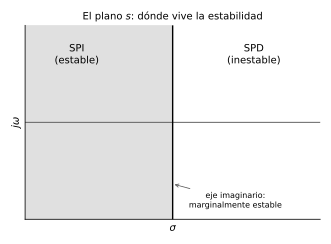

# Control Analógico
## Módulo 0 — Preliminares Matemáticos

> **Referencias:** Kuo, B.C. *Automatic Control Systems* (9ª ed.) | Ogata, K. *Modern Control Engineering* (5ª ed.)  
> **Herramientas:** Python 3.x (`control`, `scipy`, `numpy`, `matplotlib`) · GNU Octave  

---

## Índice del Módulo

- [0.1 Números Complejos](#01-números-complejos)
- [0.2 Transformada de Laplace](#02-transformada-de-laplace)
- [0.3 Fracciones Parciales y Transformada Inversa](#03-fracciones-parciales-y-transformada-inversa)
- [0.4 Transformada de Fourier](#04-transformada-de-fourier)
- [0.5 Ecuaciones Diferenciales Ordinarias](#05-ecuaciones-diferenciales-ordinarias)
- [0.6 Álgebra Matricial](#06-álgebra-matricial)
- [0.7 Herramientas Computacionales](#07-herramientas-computacionales)
- [Ejercicios de Autoevaluación](#ejercicios-de-autoevaluación)

---

## 0.1 Números Complejos

### Definición

Un número complejo $s$ se define como:

$$s = \sigma + j\omega$$

donde $\sigma = \text{Re}(s)$ es la parte real, $\omega = \text{Im}(s)$ es la parte imaginaria y $j = \sqrt{-1}$.

> **Nota de notación:** En ingeniería de control se usa $j$ en lugar de $i$ para evitar confusión con la corriente eléctrica.

### Representaciones

| Forma | Expresión |
|-------|-----------|
| Rectangular | $s = \sigma + j\omega$ |
| Polar | $s = r \angle \theta$ |
| Exponencial (Euler) | $s = r\,e^{j\theta}$ |
| Trigonométrica | $s = r(\cos\theta + j\sin\theta)$ |

Donde el módulo (magnitud) y argumento (ángulo) son:

$$r = |s| = \sqrt{\sigma^2 + \omega^2}$$

$$\theta = \angle s = \arctan\!\left(\frac{\omega}{\sigma}\right)$$

### Operaciones Fundamentales

Sean $s_1 = \sigma_1 + j\omega_1$ y $s_2 = \sigma_2 + j\omega_2$:

**Suma:**
$$s_1 + s_2 = (\sigma_1 + \sigma_2) + j(\omega_1 + \omega_2)$$

**Producto:**
$$s_1 \cdot s_2 = (\sigma_1\sigma_2 - \omega_1\omega_2) + j(\sigma_1\omega_2 + \sigma_2\omega_1)$$

En forma polar: $|s_1 s_2| = |s_1||s_2|$ y $\angle(s_1 s_2) = \angle s_1 + \angle s_2$

**Cociente (forma polar):**
$$\left|\frac{s_1}{s_2}\right| = \frac{|s_1|}{|s_2|}, \qquad \angle\frac{s_1}{s_2} = \angle s_1 - \angle s_2$$

**Conjugado:**
$$s^* = \sigma - j\omega, \qquad |s|^2 = s \cdot s^*$$

### Identidad de Euler

$$e^{j\theta} = \cos\theta + j\sin\theta$$

De donde se obtienen:

$$\cos\theta = \frac{e^{j\theta} + e^{-j\theta}}{2}, \qquad \sin\theta = \frac{e^{j\theta} - e^{-j\theta}}{2j}$$

### Plano Complejo (Plano s)

El plano complejo o **plano $s$** es fundamental en el análisis de control. Se divide en:

- **Semiplano izquierdo (SPI):** $\sigma < 0$ → sistemas estables
- **Eje imaginario:** $\sigma = 0$ → oscilación sostenida (marginalmente estable)
- **Semiplano derecho (SPD):** $\sigma > 0$ → sistemas inestables



### Ejemplo Resuelto 0.1.1

**Dado** $s_1 = 3 + j4$ y $s_2 = 1 - j2$, calcular $s_1 \cdot s_2$ y $s_1/s_2$.

**Solución:**

$$s_1 \cdot s_2 = (3)(1) - (4)(-2) + j[(3)(-2) + (4)(1)] = 3 + 8 + j(-6 + 4) = 11 - j2$$

Para el cociente, multiplicamos por el conjugado de $s_2$:

$$\frac{s_1}{s_2} = \frac{(3+j4)(1+j2)}{(1-j2)(1+j2)} = \frac{3 + j6 + j4 + j^2 8}{1 + 4} = \frac{(3-8) + j10}{5} = -1 + j2$$

### Práctica 0.1 — Python

```python
import numpy as np

# Definición de números complejos
s1 = 3 + 4j
s2 = 1 - 2j

# Operaciones
print(f"s1 = {s1}")
print(f"s2 = {s2}")
print(f"Suma       : s1 + s2 = {s1 + s2}")
print(f"Producto   : s1 * s2 = {s1 * s2}")
print(f"Cociente   : s1 / s2 = {s1 / s2:.4f}")
print(f"|s1|       = {abs(s1):.4f}")
print(f"∠s1 (rad)  = {np.angle(s1):.4f}")
print(f"∠s1 (grad) = {np.degrees(np.angle(s1)):.4f}°")
print(f"Conjugado  : s1* = {np.conj(s1)}")
```

### Práctica 0.1 — Octave

```octave
% Definición de números complejos
s1 = 3 + 4i;
s2 = 1 - 2i;

% Operaciones
fprintf('s1 = %s\n', num2str(s1))
fprintf('Producto   : s1*s2 = %s\n', num2str(s1*s2))
fprintf('Cociente   : s1/s2 = %s\n', num2str(s1/s2))
fprintf('|s1|       = %.4f\n', abs(s1))
fprintf('∠s1 (grad) = %.4f°\n', angle(s1)*180/pi)
```

---

## 0.2 Transformada de Laplace

### Definición

La Transformada de Laplace unilateral de una función $f(t)$ definida para $t \geq 0$ es:

$$\mathcal{L}\{f(t)\} = F(s) = \int_0^{\infty} f(t)\, e^{-st}\, dt$$

donde $s = \sigma + j\omega \in \mathbb{C}$ y la integral converge para $\sigma > \sigma_c$ (abscisa de convergencia).

> **Importancia en control:** Convierte ecuaciones diferenciales en ecuaciones algebraicas, facilitando enormemente el análisis de sistemas.

### Propiedades Fundamentales

| Propiedad | Expresión temporal | Expresión en $s$ |
|-----------|-------------------|-----------------|
| Linealidad | $af(t) + bg(t)$ | $aF(s) + bG(s)$ |
| Diferenciación | $\dfrac{df}{dt}$ | $sF(s) - f(0^-)$ |
| Diferenciación (2ª) | $\dfrac{d^2f}{dt^2}$ | $s^2F(s) - sf(0^-) - \dot{f}(0^-)$ |
| Integración | $\displaystyle\int_0^t f(\tau)\,d\tau$ | $\dfrac{F(s)}{s}$ |
| Traslación en $t$ | $f(t-a)\,u(t-a)$ | $e^{-as}F(s)$ |
| Traslación en $s$ | $e^{at}f(t)$ | $F(s-a)$ |
| Escalamiento | $f(at)$ | $\dfrac{1}{a}F\!\left(\dfrac{s}{a}\right)$ |
| Convolución | $f(t) * g(t)$ | $F(s)\cdot G(s)$ |
| Valor inicial | $\lim_{t\to 0^+}f(t)$ | $\lim_{s\to\infty}sF(s)$ |
| Valor final | $\lim_{t\to\infty}f(t)$ | $\lim_{s\to 0}sF(s)$ |

> ⚠️ **El teorema del valor final** solo es válido si todos los polos de $sF(s)$ están en el semiplano izquierdo estricto.

### Tabla de Transformadas Esenciales

| $f(t)$, $t \geq 0$ | $F(s)$ |
|---------------------|--------|
| $\delta(t)$ (impulso) | $1$ |
| $u(t)$ (escalón unitario) | $\dfrac{1}{s}$ |
| $t$ (rampa unitaria) | $\dfrac{1}{s^2}$ |
| $t^n$ | $\dfrac{n!}{s^{n+1}}$ |
| $e^{-at}$ | $\dfrac{1}{s+a}$ |
| $te^{-at}$ | $\dfrac{1}{(s+a)^2}$ |
| $t^n e^{-at}$ | $\dfrac{n!}{(s+a)^{n+1}}$ |
| $\sin(\omega_0 t)$ | $\dfrac{\omega_0}{s^2 + \omega_0^2}$ |
| $\cos(\omega_0 t)$ | $\dfrac{s}{s^2 + \omega_0^2}$ |
| $e^{-at}\sin(\omega_0 t)$ | $\dfrac{\omega_0}{(s+a)^2 + \omega_0^2}$ |
| $e^{-at}\cos(\omega_0 t)$ | $\dfrac{s+a}{(s+a)^2 + \omega_0^2}$ |
| $1 - e^{-at}$ | $\dfrac{a}{s(s+a)}$ |

### Ejemplo Resuelto 0.2.1 — Propiedades

Encontrar $\mathcal{L}\{t^2 e^{-3t} u(t)\}$.

**Solución:** Usando $\mathcal{L}\{t^n e^{-at}\} = \dfrac{n!}{(s+a)^{n+1}}$ con $n=2$, $a=3$:

$$\mathcal{L}\{t^2 e^{-3t}\} = \frac{2!}{(s+3)^3} = \frac{2}{(s+3)^3}$$

### Ejemplo Resuelto 0.2.2 — Teorema del Valor Final

Dado $F(s) = \dfrac{5}{s(s+2)(s+3)}$, encontrar $\lim_{t\to\infty}f(t)$.

**Solución:** Verificamos que los polos de $sF(s) = \dfrac{5}{(s+2)(s+3)}$ estén en el SPD ❌ → SPI ✔.

$$\lim_{t\to\infty}f(t) = \lim_{s\to 0}sF(s) = \lim_{s\to 0}\frac{5}{(s+2)(s+3)} = \frac{5}{(2)(3)} = \frac{5}{6}$$

### Práctica 0.2 — Python

```python
import sympy as sp

t, s, a, w0 = sp.symbols('t s a omega_0', positive=True)

# Transformada de Laplace con SymPy
f1 = t**2 * sp.exp(-3*t)
F1 = sp.laplace_transform(f1, t, s, noconds=True)
print(f"L{{t²·e^(-3t)}} = {F1}")

# Transformada inversa
F2 = 5 / (s * (s + 2) * (s + 3))
f2 = sp.inverse_laplace_transform(F2, s, t)
print(f"L⁻¹{{F(s)}} = {sp.simplify(f2)}")

# Teorema del valor final
valor_final = sp.limit(s * F2, s, 0)
print(f"Valor final = {valor_final}")
```

### Práctica 0.2 — Octave

```octave
% Tabla de transformadas con el paquete symbolic (si disponible)
% O verificación numérica con la transformada inversa numérica

pkg load signal  % Cargar paquete de señales

% Verificación del Teorema del Valor Final de forma numérica
% F(s) = 5 / (s*(s+2)*(s+3))  ->  f(t) = L^{-1}{F}
% Simulamos la respuesta al escalón del sistema 5/((s+2)(s+3))

num = [5];
den = conv([1 2], [1 3]);     % (s+2)(s+3) = s²+5s+6
sys = tf(num, den);

t = 0:0.01:10;
[y, t] = step(sys, t);        % Esto equivale a la respuesta de F(s)*(1/s)

fprintf('Valor final numérico = %.4f\n', y(end))
fprintf('Valor final teórico  = %.4f\n', 5/6)
```

---

## 0.3 Fracciones Parciales y Transformada Inversa

### Método de Fracciones Parciales

Dada una función racional propia $F(s) = \dfrac{N(s)}{D(s)}$ con $\deg N < \deg D$, se descompone según el tipo de sus raíces.

> Si $\deg N \geq \deg D$, primero realizar división polinomial para obtener parte propia.

### Caso 1 — Polos Reales Simples

$$F(s) = \frac{N(s)}{(s+p_1)(s+p_2)\cdots(s+p_n)} = \frac{K_1}{s+p_1} + \frac{K_2}{s+p_2} + \cdots$$

Los residuos se calculan con la **fórmula de Heaviside**:

$$K_i = \left[(s+p_i)F(s)\right]_{s=-p_i}$$

### Caso 2 — Polos Reales Repetidos

Si $s = -p$ es polo de orden $m$:

$$F(s) = \frac{A_m}{(s+p)^m} + \frac{A_{m-1}}{(s+p)^{m-1}} + \cdots + \frac{A_1}{s+p} + \cdots$$

$$A_{m-k} = \frac{1}{k!}\left[\frac{d^k}{ds^k}(s+p)^m F(s)\right]_{s=-p}$$

### Caso 3 — Polos Complejos Conjugados

Si $s = -\alpha \pm j\beta$ son polos complejos conjugados:

$$\frac{As + B}{(s+\alpha)^2 + \beta^2}$$

que en el tiempo corresponde a:

$$\mathcal{L}^{-1}\left\{\frac{As+B}{(s+\alpha)^2+\beta^2}\right\} = Ce^{-\alpha t}\cos(\beta t + \phi)$$

### Ejemplo Resuelto 0.3.1 — Polos Simples

$$F(s) = \frac{2s+5}{(s+1)(s+3)}$$

**Solución:**

$$F(s) = \frac{K_1}{s+1} + \frac{K_2}{s+3}$$

$$K_1 = \left[(s+1)\cdot\frac{2s+5}{(s+1)(s+3)}\right]_{s=-1} = \frac{2(-1)+5}{(-1+3)} = \frac{3}{2}$$

$$K_2 = \left[(s+3)\cdot\frac{2s+5}{(s+1)(s+3)}\right]_{s=-3} = \frac{2(-3)+5}{(-3+1)} = \frac{-1}{-2} = \frac{1}{2}$$

$$\boxed{f(t) = \frac{3}{2}e^{-t} + \frac{1}{2}e^{-3t}, \quad t \geq 0}$$

### Ejemplo Resuelto 0.3.2 — Polos Complejos

$$F(s) = \frac{s+3}{s^2+2s+5} = \frac{s+3}{(s+1)^2+4}$$

**Solución:** Reescribimos el numerador en términos de $(s+1)$:

$$F(s) = \frac{(s+1)+2}{(s+1)^2+2^2} = \frac{s+1}{(s+1)^2+4} + \frac{2}{(s+1)^2+4}$$

$$\boxed{f(t) = e^{-t}\cos(2t) + e^{-t}\sin(2t), \quad t \geq 0}$$

### Práctica 0.3 — Python

```python
import sympy as sp

s = sp.Symbol('s')

# Ejemplo 1: Polos reales simples
F1 = (2*s + 5) / ((s + 1)*(s + 3))
f1 = sp.inverse_laplace_transform(F1, s, sp.Symbol('t', positive=True))
print(f"f1(t) = {sp.simplify(f1)}")

# Fracciones parciales con sympy
print(f"\nFracciones parciales de F1:")
print(sp.apart(F1, s))

# Ejemplo 2: Polos complejos conjugados
F2 = (s + 3) / (s**2 + 2*s + 5)
f2 = sp.inverse_laplace_transform(F2, s, sp.Symbol('t', positive=True))
print(f"\nf2(t) = {sp.simplify(f2)}")
```

### Práctica 0.3 — Octave

```octave
% Descomposición en fracciones parciales con residue()
% F(s) = (2s+5)/((s+1)(s+3)) = (2s+5)/(s²+4s+3)

num = [2 5];
den = [1 4 3];  % s²+4s+3

[r, p, k] = residue(num, den)
% r: residuos, p: polos, k: término directo

fprintf('Residuo K1 = %.4f (polo s = %.4f)\n', r(1), p(1))
fprintf('Residuo K2 = %.4f (polo s = %.4f)\n', r(2), p(2))
```

---

## 0.4 Transformada de Fourier

### Definición y Relación con Laplace

La Transformada de Fourier de $f(t)$ es:

$$\mathcal{F}\{f(t)\} = F(j\omega) = \int_{-\infty}^{\infty} f(t)\,e^{-j\omega t}\,dt$$

**Relación clave:** $F(j\omega) = F(s)\big|_{s=j\omega}$, es decir, la Transformada de Fourier es la Transformada de Laplace evaluada sobre el eje imaginario.

> Esta relación es la base de los diagramas de Bode (Módulo 7).

### Par de Fourier

$$f(t) = \mathcal{F}^{-1}\{F(j\omega)\} = \frac{1}{2\pi}\int_{-\infty}^{\infty} F(j\omega)\,e^{j\omega t}\,d\omega$$

### Propiedades Relevantes para Control

| Propiedad | Tiempo | Frecuencia |
|-----------|--------|------------|
| Linealidad | $af + bg$ | $aF + bG$ |
| Diferenciación | $\dfrac{df}{dt}$ | $j\omega F(j\omega)$ |
| Convolución | $f * g$ | $F(j\omega)\cdot G(j\omega)$ |
| Parseval | $\displaystyle\int_{-\infty}^{\infty}|f|^2\,dt$ | $\dfrac{1}{2\pi}\displaystyle\int_{-\infty}^{\infty}|F|^2\,d\omega$ |
| Simetría Hermítica | $f(t)$ real | $F(-j\omega) = F^*(j\omega)$ |

### Densidad Espectral de Potencia

Para señales de energía finita, la densidad espectral de energía es:

$$S(\omega) = |F(j\omega)|^2$$

> En control, el análisis frecuencial usa $F(j\omega)$ para caracterizar cómo un sistema amplifica o atenúa cada componente de frecuencia.

### Práctica 0.4 — Python

```python
import numpy as np
import matplotlib.pyplot as plt

# Transformada de Fourier Numérica (FFT) de un pulso rectangular
fs = 1000          # Frecuencia de muestreo (Hz)
T  = 1             # Duración del pulso (s)
t  = np.linspace(-2, 2, 4*fs)
f  = np.where(np.abs(t) <= T/2, 1.0, 0.0)   # Pulso rect de ancho T

# FFT
F      = np.fft.fftshift(np.fft.fft(f)) / fs
freqs  = np.fft.fftshift(np.fft.fftfreq(len(t), 1/fs))
omega  = 2 * np.pi * freqs

# Solución analítica: F(jω) = T·sinc(ωT/2π) = T·sinc(fT)
F_analitica = T * np.sinc(freqs * T)

fig, axs = plt.subplots(1, 2, figsize=(12, 4))
axs[0].plot(t, f)
axs[0].set_title('Pulso rectangular $f(t)$')
axs[0].set_xlabel('Tiempo (s)'); axs[0].set_ylabel('Amplitud')
axs[0].grid(True)

axs[1].plot(freqs, np.abs(F),          label='FFT numérica')
axs[1].plot(freqs, np.abs(F_analitica),'--', label='Analítica $T\\cdot\\mathrm{sinc}(fT)$')
axs[1].set_xlim([-5, 5])
axs[1].set_title('Espectro $|F(j\\omega)|$')
axs[1].set_xlabel('Frecuencia (Hz)'); axs[1].set_ylabel('Magnitud')
axs[1].legend(); axs[1].grid(True)

plt.tight_layout()
plt.savefig('fourier_pulso.png', dpi=150)
plt.show()
```

---

## 0.5 Ecuaciones Diferenciales Ordinarias

### Relevancia en Control

Los modelos de sistemas físicos se expresan como EDOs. La Transformada de Laplace permite resolverlas algebraicamente, pero es esencial entender la solución clásica.

### Solución General

Para una EDO lineal de coeficientes constantes de orden $n$:

$$a_n y^{(n)} + a_{n-1}y^{(n-1)} + \cdots + a_1\dot{y} + a_0 y = b_m u^{(m)} + \cdots + b_0 u$$

La solución general es:

$$y(t) = y_h(t) + y_p(t)$$

donde:
- $y_h(t)$ = **solución homogénea** (respuesta libre, depende de condiciones iniciales)
- $y_p(t)$ = **solución particular** (respuesta forzada, depende de la entrada $u(t)$)

### Ecuación Característica

$$a_n\lambda^n + a_{n-1}\lambda^{n-1} + \cdots + a_1\lambda + a_0 = 0$$

Las raíces $\lambda_i$ determinan el comportamiento libre del sistema:

| Raíces $\lambda$ | Forma de $y_h$ | Comportamiento |
|-----------------|----------------|----------------|
| Real negativa $-a$ | $Ce^{-at}$ | Decae exponencialmente |
| Real positiva $+a$ | $Ce^{at}$ | Crece (inestable) |
| Imaginaria pura $\pm j\omega$ | $C\cos(\omega t + \phi)$ | Oscilación sostenida |
| Compleja $-\alpha \pm j\omega$ | $Ce^{-\alpha t}\cos(\omega t+\phi)$ | Oscilación amortiguada |
| Real repetida $-a$ (orden $m$) | $(C_1+C_2 t+\cdots+C_m t^{m-1})e^{-at}$ | Decaimiento polinomial |

### Método Operacional con Laplace

**Procedimiento:**

1. Aplicar $\mathcal{L}\{\cdot\}$ a ambos lados de la EDO
2. Sustituir condiciones iniciales
3. Despejar $Y(s)$
4. Aplicar $\mathcal{L}^{-1}\{\cdot\}$ (fracciones parciales)

### Ejemplo Resuelto 0.5.1

Resolver $\ddot{y} + 5\dot{y} + 6y = 0$ con $y(0)=1$, $\dot{y}(0)=0$.

**Solución:**

Aplicando Laplace:
$$s^2Y(s) - s\cdot y(0) - \dot{y}(0) + 5[sY(s) - y(0)] + 6Y(s) = 0$$
$$(s^2 + 5s + 6)Y(s) = s + 5$$

$$Y(s) = \frac{s+5}{(s+2)(s+3)}$$

Fracciones parciales:

$$K_1 = \frac{-2+5}{-2+3} = 3, \qquad K_2 = \frac{-3+5}{-3+2} = -2$$

$$\boxed{y(t) = 3e^{-2t} - 2e^{-3t}, \quad t \geq 0}$$

### Ejemplo Resuelto 0.5.2

Resolver $\ddot{y} + 2\dot{y} + 5y = 5$ con condiciones iniciales nulas.

**Solución:**

$$Y(s) = \frac{5}{s(s^2+2s+5)}$$

Polos: $s=0$, $s = -1 \pm j2$

$$Y(s) = \frac{1}{s} - \frac{s+2}{(s+1)^2+4}$$

$$Y(s) = \frac{1}{s} - \frac{s+1}{(s+1)^2+4} - \frac{1}{2}\cdot\frac{2}{(s+1)^2+4}$$

$$\boxed{y(t) = 1 - e^{-t}\cos(2t) - \frac{1}{2}e^{-t}\sin(2t), \quad t \geq 0}$$

### Práctica 0.5 — Python

```python
import numpy as np
import matplotlib.pyplot as plt
from scipy.integrate import solve_ivp

# Resolver ÿ + 2ẏ + 5y = 5, y(0)=0, ẏ(0)=0
def sistema(t, y_vec):
    y, dy = y_vec
    ddy = 5 - 2*dy - 5*y
    return [dy, ddy]

t_span = (0, 6)
t_eval = np.linspace(*t_span, 500)
sol = solve_ivp(sistema, t_span, [0, 0], t_eval=t_eval)

# Solución analítica
t = sol.t
y_analitica = 1 - np.exp(-t)*np.cos(2*t) - 0.5*np.exp(-t)*np.sin(2*t)

plt.figure(figsize=(9, 4))
plt.plot(sol.t, sol.y[0], 'b-',  linewidth=2, label='scipy (numérica)')
plt.plot(t,    y_analitica, 'r--', linewidth=2, label='Analítica')
plt.axhline(1, color='gray', linestyle=':', label='Estado estacionario = 1')
plt.title(r'Solución de $\ddot{y}+2\dot{y}+5y=5$')
plt.xlabel('Tiempo (s)'); plt.ylabel('y(t)')
plt.legend(); plt.grid(True)
plt.tight_layout()
plt.savefig('edo_solucion.png', dpi=150)
plt.show()
```

### Práctica 0.5 — Octave

```octave
% Resolver ÿ + 2ẏ + 5y = 5 con condiciones iniciales nulas
function dydt = sistema(t, y)
  dydt = [y(2);
          5 - 2*y(2) - 5*y(1)];
endfunction

t_span = [0 6];
y0     = [0; 0];
[t, Y] = ode45(@sistema, t_span, y0);

% Solución analítica
y_analitica = 1 - exp(-t).*cos(2*t) - 0.5*exp(-t).*sin(2*t);

figure
plot(t, Y(:,1), 'b-', 'LineWidth', 2); hold on
plot(t, y_analitica, 'r--', 'LineWidth', 2)
yline(1, 'k:', 'LineWidth', 1.5)
legend('ode45 (numérica)', 'Analítica', 'Estado estacionario')
xlabel('Tiempo (s)'); ylabel('y(t)')
title('Solución de \ddot{y}+2\dot{y}+5y=5')
grid on
```

---

## 0.6 Álgebra Matricial

### Conceptos Esenciales

Un sistema de $n$ ecuaciones puede escribirse en forma matricial $\mathbf{A}\mathbf{x} = \mathbf{b}$. En control moderno, los sistemas se describen en espacio de estado como:

$$\dot{\mathbf{x}} = \mathbf{A}\mathbf{x} + \mathbf{B}\mathbf{u}$$
$$\mathbf{y} = \mathbf{C}\mathbf{x} + \mathbf{D}\mathbf{u}$$

### Operaciones Matriciales Clave

**Determinante** (para $2\times 2$):
$$\det\begin{pmatrix}a&b\\c&d\end{pmatrix} = ad - bc$$

**Inversa** (para $2\times 2$):
$$\mathbf{A}^{-1} = \frac{1}{\det(\mathbf{A})}\begin{pmatrix}d&-b\\-c&a\end{pmatrix}$$

**Valores propios (eigenvalores):**

$$\det(\lambda\mathbf{I} - \mathbf{A}) = 0 \quad \Rightarrow \quad \text{Ecuación característica}$$

> Los valores propios de $\mathbf{A}$ son los polos del sistema en espacio de estado.

### Función Matricial Exponencial

La solución de $\dot{\mathbf{x}} = \mathbf{A}\mathbf{x}$ es:

$$\mathbf{x}(t) = e^{\mathbf{A}t}\mathbf{x}(0)$$

donde la **matriz de transición** es:

$$e^{\mathbf{A}t} = \mathbf{I} + \mathbf{A}t + \frac{(\mathbf{A}t)^2}{2!} + \frac{(\mathbf{A}t)^3}{3!} + \cdots = \mathcal{L}^{-1}\{(s\mathbf{I}-\mathbf{A})^{-1}\}$$

### Ejemplo Resuelto 0.6.1

Dada $\mathbf{A} = \begin{pmatrix}-2 & 1 \\ 0 & -3\end{pmatrix}$, encontrar los valores propios.

**Solución:**

$$\det(\lambda\mathbf{I}-\mathbf{A}) = \det\begin{pmatrix}\lambda+2 & -1 \\ 0 & \lambda+3\end{pmatrix} = (\lambda+2)(\lambda+3) = 0$$

$$\boxed{\lambda_1 = -2, \quad \lambda_2 = -3}$$

Ambos valores propios en el SPD (parte real negativa) → sistema estable.

### Práctica 0.6 — Python

```python
import numpy as np
from scipy.linalg import expm

A = np.array([[-2, 1],
              [ 0, -3]])

# Valores propios y vectores propios
eigenvalores, eigenvectores = np.linalg.eig(A)
print(f"Eigenvalores: {eigenvalores}")
print(f"Eigenvectores:\n{eigenvectores}")

# Determinante e inversa
print(f"\ndet(A) = {np.linalg.det(A):.4f}")
print(f"A⁻¹ =\n{np.linalg.inv(A)}")

# Exponencial matricial en t=0.5
t = 0.5
eAt = expm(A * t)
print(f"\ne^(A·{t}) =\n{eAt}")
```

### Práctica 0.6 — Octave

```octave
A = [-2  1; 0  -3];

% Eigenvalores
lambda = eig(A);
fprintf('Eigenvalores: %.4f, %.4f\n', lambda(1), lambda(2))

% Determinante e inversa
fprintf('det(A) = %.4f\n', det(A))
disp('A^{-1} ='); disp(inv(A))

% Exponencial matricial en t=0.5
disp('e^{A*0.5} ='); disp(expm(A*0.5))
```

---

## 0.7 Herramientas Computacionales

### Instalación del Entorno Python

```bash
# Crear entorno virtual (recomendado)
python -m venv env_control
source env_control/bin/activate        # Linux/macOS
env_control\Scripts\activate           # Windows

# Instalar paquetes
pip install numpy scipy matplotlib sympy control jupyter
```

### Librería `control` de Python

La librería `python-control` es la herramienta central del curso:

```python
import control as ct
import numpy as np
import matplotlib.pyplot as plt

# Crear función de transferencia: G(s) = 10 / (s² + 3s + 10)
num = [10]
den = [1, 3, 10]
G = ct.tf(num, den)
print(G)

# Polos y ceros
print(f"Polos: {ct.poles(G)}")
print(f"Ceros: {ct.zeros(G)}")

# Respuesta al escalón
t, y = ct.step_response(G)
plt.figure(figsize=(8, 4))
plt.plot(t, y, 'b-', linewidth=2)
plt.title('Respuesta al escalón de G(s)')
plt.xlabel('Tiempo (s)'); plt.ylabel('Salida y(t)')
plt.grid(True)
plt.tight_layout()
plt.show()
```

### Octave — Paquetes de Control

```octave
% Instalar el paquete de control (primera vez)
pkg install -forge control

% Cargar el paquete
pkg load control

% Crear función de transferencia
num = [10];
den = [1 3 10];
G = tf(num, den)

% Polos y ceros
polos = pole(G)
ceros = zero(G)

% Respuesta al escalón
figure
step(G)
grid on
title('Respuesta al escalón de G(s)')
```

### Verificación del Entorno

```python
# Script de verificación de instalación (Python)
import importlib

paquetes = ['numpy', 'scipy', 'matplotlib', 'sympy', 'control']
for pkg in paquetes:
    try:
        m = importlib.import_module(pkg)
        version = getattr(m, '__version__', 'OK')
        print(f"  ✅ {pkg:<15} v{version}")
    except ImportError:
        print(f"  ❌ {pkg:<15} NO INSTALADO")
```

```octave
% Script de verificación (Octave)
paquetes = {'control', 'signal', 'symbolic'};
for i = 1:length(paquetes)
  if exist(paquetes{i}) == 7
    fprintf('  OK  %s\n', paquetes{i})
  else
    fprintf('  NO  %s  (instalar con: pkg install -forge %s)\n', ...
             paquetes{i}, paquetes{i})
  end
end
```

---

## Ejercicios de Autoevaluación

### Serie A — Números Complejos

**A.1** Calcular módulo y argumento de $s = -4 + j3$.

**A.2** Expresar en forma rectangular: $s = 5\angle{143.13°}$.

**A.3** Si $G(j\omega) = \dfrac{1}{j\omega + 2}$, calcular $|G(j2)|$ y $\angle G(j2)$.

**A.4** Dado $H(s) = \dfrac{s+1}{s^2+4s+8}$, identificar polos y ceros. ¿Dónde están en el plano $s$?

---

### Serie B — Transformada de Laplace

**B.1** Calcular $\mathcal{L}\{e^{-2t}\sin(3t)\,u(t)\}$.

**B.2** Calcular $\mathcal{L}\{t\,e^{-t}\cos(2t)\}$ *(usar propiedad de diferenciación en $s$)*.

**B.3** Aplicar el Teorema del Valor Final a $F(s) = \dfrac{4}{s(s^2+2s+4)}$.

**B.4** Aplicar el Teorema del Valor Inicial a $F(s) = \dfrac{s+3}{s^2+5s+6}$.

---

### Serie C — Fracciones Parciales

**C.1** Descomponer en fracciones parciales y encontrar $f(t)$:

$$F(s) = \frac{3s+7}{s^2+5s+6}$$

**C.2** Descomponer e invertir:

$$F(s) = \frac{s^2+3s+1}{s(s+1)^2}$$

**C.3** Descomponer e invertir:

$$F(s) = \frac{2s+3}{s^2+2s+5}$$

---

### Serie D — EDOs con Laplace

**D.1** Resolver: $\dot{y} + 4y = 8$, $y(0) = 2$.

**D.2** Resolver: $\ddot{y} + 4\dot{y} + 3y = 0$, $y(0) = 1$, $\dot{y}(0) = -1$.

**D.3** Resolver: $\ddot{y} + 6\dot{y} + 9y = 9$, condiciones iniciales nulas. Identificar el tipo de amortiguamiento.

**D.4** *(Desafío)* Resolver: $\ddot{y} + 2\dot{y} + 10y = 20u(t)$, $y(0) = 0$, $\dot{y}(0) = 1$. Encontrar el valor en estado estacionario y la frecuencia de oscilación transitoria.

---

### Serie E — Computacional

**E.1** En Python o Octave, graficar la respuesta $f(t) = e^{-t}[\cos(2t) + \sin(2t)]$ para $0 \leq t \leq 5$ s. Verificar con la transformada inversa de $F(s)$.

**E.2** Usar `residue` (Octave) o `sp.apart` (Python) para verificar los resultados de **C.1** y **C.2**.

**E.3** Resolver **D.4** numéricamente con `solve_ivp` (Python) u `ode45` (Octave) y comparar con la solución analítica en una gráfica.

**E.4** Calcular la respuesta al escalón de $G(s) = \dfrac{10}{(s+1)(s+5)}$ y medir gráficamente el valor final, la constante de tiempo aproximada y el tiempo de establecimiento al 2%.

---

### Respuestas Clave

| Ejercicio | Respuesta |
|-----------|-----------|
| A.1 | $|s|=5$, $\angle s = 143.13°$ |
| A.3 | $|G|=1/\sqrt{8}\approx 0.354$, $\angle G = -45°$ |
| B.1 | $\dfrac{3}{(s+2)^2+9}$ |
| B.3 | Valor final $= 1$ |
| C.1 | $f(t) = 4e^{-2t} - e^{-3t}$ |
| D.1 | $y(t) = 2$ (constante, ya está en estado estacionario) |
| D.2 | $y(t) = e^{-t} - 0$ ... *resolver completo como ejercicio* |

---

## Resumen del Módulo

| Herramienta | Uso en Control |
|-------------|---------------|
| Números complejos | Localización de polos y ceros en el plano $s$ |
| Transformada de Laplace | Análisis de sistemas LTI, función de transferencia |
| Fracciones parciales | Transformada inversa → respuesta temporal |
| Transformada de Fourier | Base para diagramas de Bode (análisis en frecuencia) |
| EDOs | Modelado matemático de sistemas físicos |
| Álgebra matricial | Representación en espacio de estado |
| Python / Octave | Simulación, verificación y diseño |

---

*Siguiente: **Módulo 1 — Modelado de Sistemas Físicos***
