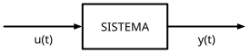

# Control Analógico
## Módulo 1 — Modelado de Sistemas Físicos
### *Aprender a ver el mundo como sistemas*

> **Referencias:** Kuo, *Automatic Control Systems* (Cap. 4) | Ogata, *Modern Control Engineering* (Caps. 2–3)  
> **Herramientas:** Python (`control`, `sympy`, `scipy`, `matplotlib`) · GNU Octave  
> **Prerrequisito:** Módulo 0

---

### Cómo leer este módulo

Cada sección sigue esta lógica, y te pido que la exijas siempre:

1. **¿Qué problema del mundo real estamos mirando?** — la situación antes de la fórmula.
2. **¿Por qué necesitamos un modelo?** — qué ganamos al traducir la realidad a ecuaciones.
3. **¿Cómo se construye?** — la mecánica (aquí están las matemáticas).
4. **¿Qué me dice el modelo que no veía antes?** — la lectura, la intuición.
5. **¿Dónde más aparece esto?** — transferir la idea a sistemas que nada tienen que ver.

Si en algún punto solo ves álgebra, te has saltado los pasos 1, 4 y 5. Vuelve.

---

## 1.0 La gran idea: por qué existe este módulo

Antes de cualquier ecuación, fijemos el propósito del curso entero.

**Controlar algo significa hacer que se comporte como tú quieres**, a pesar de que el mundo lo empuje en otras direcciones. Un horno que mantiene 200 °C aunque abras la puerta. Un dron que se queda quieto en el aire aunque sople el viento. Tu propio cuerpo manteniendo 37 °C en invierno y verano.

Para lograr eso necesitas, primero, **poder predecir cómo reaccionará el sistema antes de tocarlo**. No puedes diseñar un control para algo cuyo comportamiento no sabes anticipar. Esa capacidad de predicción es exactamente lo que un *modelo* te da: una máquina de "¿qué pasaría si...?" que puedes interrogar en papel o en computadora, sin romper nada real.

> **La tesis del módulo:** Modelar no es "hacer matemáticas de un sistema". Es construir una versión de bolsillo del sistema con la que puedas experimentar gratis, mil veces, antes de gastar un solo tornillo. Todo lo demás del curso (estabilidad, diseño de controladores) opera sobre este modelo. Si el modelo es bueno, el control será bueno. Si no entiendes lo que el modelo significa, estarás diseñando a ciegas.

Y hay una segunda idea, más sutil y más poderosa, que es la verdadera razón por la que esta materia sirve incluso fuera de la ingeniería de control:

**Sistemas físicos totalmente distintos se comportan igual por dentro.** Un edificio meciéndose en un sismo, un circuito de radio, la población de conejos y zorros en un bosque, el precio de un activo que sube y baja: todos pueden describirse con las mismas pocas estructuras matemáticas. Cuando dominas esas estructuras, dejas de ver "un problema de mecánica" o "un problema de finanzas" y empiezas a ver *el mismo problema con distinto disfraz*. Eso es lo que te permitirá, al final, atacar problemas para los que nadie te dio una fórmula.

---

## 1.1 ¿Qué es un sistema, y por qué ese marco mental lo cambia todo?

### El cambio de mirada

Lo primero que hace un ingeniero de control no es calcular: es **dibujar una caja**.



Esta caja es engañosamente simple, pero contiene una decisión profunda: **separar lo que metes (entrada/causa) de lo que obtienes (salida/efecto), y declarar que entre ambas hay una relación estable que puedes estudiar.**

¿Por qué importa? Porque te libera de los detalles internos. No necesitas entender cada átomo del horno para controlarlo; necesitas saber *cómo responde su temperatura (salida) cuando subes la potencia (entrada)*. La caja te da permiso para ignorar lo irrelevante y concentrarte en la relación causa-efecto. Esto es pensamiento de sistemas, y es transferible a cualquier cosa: una empresa (entrada: inversión, salida: ingresos), un cuerpo (entrada: medicamento, salida: presión arterial), un ecosistema.

### Por qué nos obsesiona la linealidad

De todos los sistemas posibles, perseguimos uno tipo especial: los **lineales e invariantes en el tiempo (LTI)**. No por capricho, sino porque son los únicos que entendemos *completamente*. Un sistema es LTI si:

- **Superposición:** la respuesta a dos entradas sumadas es la suma de las respuestas. Si empujar con 1 N mueve algo 2 cm, empujar con 2 N lo mueve 4 cm. Sin sorpresas.
- **Invariancia temporal:** el sistema se comporta igual hoy que mañana. Empujar ahora o dentro de una hora da el mismo resultado, solo desplazado en el tiempo.

$$au_1 + bu_2 \;\to\; ay_1 + by_2 \qquad\qquad u(t-\tau)\;\to\;y(t-\tau)$$

**¿Por qué nos importa tanto esto, prácticamente?** Porque para un sistema LTI puedes hacer algo casi mágico: si conoces su respuesta a *una sola* entrada simple, puedes predecir su respuesta a *cualquier* entrada. Toda la maquinaria de Laplace, funciones de transferencia, polos y ceros que viene después **solo funciona en sistemas LTI**. Por eso el resto del módulo, en el fondo, es un esfuerzo por encontrar (o forzar) la linealidad en sistemas reales que casi nunca lo son perfectamente.

> **Para llevarte:** Cuando enfrentes cualquier sistema nuevo en tu vida profesional, la primera pregunta útil no es "¿qué ecuación tiene?" sino "**¿qué es la entrada, qué es la salida, y se comporta de forma proporcional y predecible?**". Si la respuesta a lo último es sí, tienes a tu disposición un siglo de teoría. Si es no, tu trabajo será aproximarlo a un sí (sección 1.6).

---

## 1.2 Sistemas mecánicos: el laboratorio de intuición

### Por qué empezamos aquí

Empezamos por lo mecánico no porque sea lo más común en control, sino porque **lo puedes sentir con el cuerpo**. Has empujado objetos, estirado resortes, sentido la resistencia del agua. Esa intuición física es un andamio: una vez que entiendes el comportamiento aquí, lo reconocerás en circuitos y procesos que no puedes tocar.

### Los tres personajes de toda dinámica

Casi cualquier sistema mecánico se arma con tres elementos, y cada uno encarna un comportamiento universal que vale la pena entender como *concepto*, no como fórmula:

| Elemento | Fórmula | Qué representa conceptualmente |
|----------|---------|-------------------------------|
| **Masa** $M$ | $f = M\ddot{x}$ | **Inercia / memoria de movimiento.** Se resiste a cambiar de velocidad. Almacena energía y la devuelve. Es la razón de que las cosas "sigan de largo" y oscilen. |
| **Resorte** $K$ | $f = Kx$ | **Restauración / memoria de posición.** Quiere volver al equilibrio. Almacena energía y la devuelve. Es la fuente de las oscilaciones. |
| **Amortiguador** $B$ | $f = B\dot{x}$ | **Disipación / fricción.** Se opone al movimiento y convierte energía en calor perdido. Es lo que *calma* las oscilaciones. |

Detente en esta idea, porque es de las más importantes del curso:

> **Masa y resorte son los que pelean (almacenan energía y se la pasan de uno a otro, creando oscilación). El amortiguador es el árbitro que va apagando la pelea (disipa energía). El balance entre estos tres decide si un sistema oscila salvajemente, vuelve suave al reposo, o se queda tieso.** Esta tensión entre "almacenar" y "disipar" gobierna desde un puente hasta un mercado financiero.

### Construyendo el modelo, y leyendo lo que dice

Tomemos el sistema masa-resorte-amortiguador. La física es la Segunda Ley de Newton, que aquí significa: *la suma de todo lo que empuja a la masa es igual a su masa por su aceleración.*

$$\underbrace{f(t)}_{\text{lo que aplicas}} - \underbrace{Kx}_{\text{el resorte tira de vuelta}} - \underbrace{B\dot{x}}_{\text{la fricción frena}} = \underbrace{M\ddot{x}}_{\text{inercia}}$$

Reordenando y pasando a Laplace (que convierte esta ecuación diferencial en álgebra simple, ese es *todo* el truco de Laplace):

$$\boxed{G(s) = \frac{X(s)}{F(s)} = \frac{1}{Ms^2 + Bs + K}}$$

**Ahora, lo crucial — qué te dice este modelo que no veías:**

Mira el denominador $Ms^2 + Bs + K$. Cada término es uno de los tres personajes: la $M$ va con $s^2$ (aceleración), la $B$ con $s$ (velocidad), la $K$ sola (posición). **La estructura de la ecuación es un retrato de la física.** Si alguien te muestra solo el denominador, puedes reconstruir qué elementos físicos hay dentro.

Y más: las **raíces de ese denominador** (los *polos*, que veremos a fondo en módulos posteriores) te dicen de antemano si el sistema oscilará, qué tan rápido se calmará, si es estable. Sin construir nada. Esa es la potencia de tener un modelo: **leer el comportamiento futuro en la forma de la ecuación.**

### El sistema rotacional, y un detalle que importará mucho después

El mismo trío aparece girando: inercia $J$, fricción $B$, par $T$. Para un disco con fricción:

$$J\ddot{\theta} + B\dot{\theta} = T(t) \;\Rightarrow\; G(s) = \frac{1}{s(Js+B)}$$

Fíjate en algo: **no hay resorte, y aparece una $s$ sola multiplicando** (un polo en el origen). Conceptualmente esto significa: *si dejas de aplicar par, el disco no vuelve a ninguna posición de equilibrio — se queda donde quedó.* No tiene "memoria de posición". Esa ausencia de resorte tendrá una consecuencia enorme cuando lleguemos a errores en estado estacionario (Módulo 4): los sistemas con ese polo en el origen pueden seguir una orden de posición sin error permanente. Guárdate esta observación; la cobraremos.

### Práctica 1.2 — Python

```python
import numpy as np
import control as ct
import matplotlib.pyplot as plt

# Exploremos cómo el amortiguador B cambia el "carácter" del sistema
M, K = 1.0, 10.0
plt.figure(figsize=(9, 5))

for B in [0.5, 2.0, 6.4, 12.0]:        # de poco a mucho amortiguamiento
    G = ct.tf([1], [M, B, K])
    t, y = ct.step_response(G)
    zeta = B / (2*np.sqrt(K*M))         # factor de amortiguamiento
    plt.plot(t, y, linewidth=2, label=f'B={B}  (ζ={zeta:.2f})')

plt.title('El mismo sistema, distinto amortiguador: de oscilar a no oscilar')
plt.xlabel('Tiempo (s)'); plt.ylabel('Desplazamiento x(t)')
plt.legend(); plt.grid(True)
plt.tight_layout()
plt.savefig('caracter_amortiguamiento.png', dpi=150)
plt.show()

# Pregunta para ti: ¿en qué valor de B deja de oscilar? ¿Por qué ese y no otro?
```

### Práctica 1.2 — Octave

```octave
pkg load control
M = 1.0; K = 10.0;
figure; hold on
for B = [0.5 2.0 6.4 12.0]
  G = tf([1], [M B K]);
  [y, t] = step(G);
  zeta = B / (2*sqrt(K*M));
  plot(t, y, 'LineWidth', 2, 'DisplayName', sprintf('B=%.1f (zeta=%.2f)', B, zeta))
end
legend show; grid on
xlabel('Tiempo (s)'); ylabel('x(t)')
title('Mismo sistema, distinto amortiguador')
```

> **Ejercicio de visión (no de cálculo):** Corre el código. Verás curvas que van desde "rebota mucho antes de calmarse" hasta "sube lento sin rebotar". Ese parámetro $\zeta$ que aparece es la *proporción entre disipar y almacenar*. Cuando entiendas que **una sola cantidad gobierna el carácter de la respuesta**, habrás entendido el corazón del comportamiento de segundo orden — y lo reconocerás en todo lo que oscile.

---

## 1.3 Sistemas eléctricos: la misma película, otro reparto

### Por qué un curso de control pasa tanto tiempo en circuitos

Dos razones, una práctica y una profunda.

La práctica: **los controladores reales se construyen con electrónica.** Cuando diseñes un PID en el Módulo 8, lo implementarás con amplificadores operacionales, resistencias y capacitores. Necesitas saber qué hace cada uno.

La profunda, y es la que quiero que internalices: **los circuitos son el "idioma universal" al que traducimos otros sistemas.** Como un circuito es barato de construir y medir, durante décadas los ingenieros estudiaban sistemas mecánicos, hidráulicos o térmicos *construyendo el circuito equivalente y midiéndolo*. El circuito era la computadora analógica. Esa idea — "no entiendo bien este sistema, déjame mapearlo a uno que sí entiendo" — es una de las herramientas de pensamiento más valiosas que te llevarás.

### El reparto eléctrico, leído como comportamiento

| Elemento | Relación | Qué representa (compáralo con lo mecánico) |
|----------|----------|---------------------------------------------|
| **Inductancia** $L$ | $v = L\,di/dt$ | Inercia eléctrica. Se resiste a cambios de corriente. **Es la "masa" del circuito.** |
| **Capacitancia** $C$ | $i = C\,dv/dt$ | Almacena carga, "quiere" mantener su voltaje. **Es el "resorte".** |
| **Resistencia** $R$ | $v = Ri$ | Disipa energía en calor. **Es el "amortiguador".** |

¿Notas lo que está pasando? Antes de escribir una sola ecuación de circuito, ya sabes que un RLC se va a comportar como un masa-resorte-amortiguador, porque **tiene los mismos tres personajes**. Esto no es coincidencia; es la idea central que desarrollaremos en 1.4.

### El atajo que todo ingeniero usa: impedancias

Aquí va un consejo metodológico que te ahorrará horas. Podrías plantear las ecuaciones diferenciales del circuito con las leyes de Kirchhoff y sufrir con integrales. O puedes usar **impedancias**: tratar cada elemento como una "resistencia generalizada" en el dominio de $s$ y aplicar las reglas de circuitos que ya conoces (divisores de voltaje, serie/paralelo).

$$Z_R = R, \qquad Z_L = Ls, \qquad Z_C = \frac{1}{Cs}$$

Para un RLC serie con salida en el capacitor, es solo un divisor de voltaje:

$$G(s) = \frac{Z_C}{Z_R + Z_L + Z_C} = \frac{1}{LCs^2 + RCs + 1}$$

> **La lección que trasciende los circuitos:** Cuando un problema se vuelve difícil en un dominio (ecuaciones diferenciales en el tiempo), a veces existe **otro dominio donde el mismo problema es fácil** (álgebra en $s$). Buena parte de la ingeniería consiste en reconocer a qué dominio mudarte. Laplace, impedancias, y más adelante el dominio de la frecuencia, son todos ejemplos de esta única estrategia.

### Amplificadores operacionales: de analizar a *construir* comportamiento

Hasta ahora analizamos sistemas que existen. El Amp-Op invierte el juego: te deja **diseñar la función de transferencia que tú quieras** eligiendo dos impedancias.

$$\frac{V_o(s)}{V_i(s)} = -\frac{Z_f(s)}{Z_i(s)}$$

Pon una resistencia en la entrada y un capacitor en la realimentación, y obtienes $-1/RCs$: **un integrador.** Acabas de fabricar la operación "integral" con tres componentes. Intercámbialos y tendrás un derivador. Combínalos y construyes un PID completo.

> **Por qué esto te debe emocionar:** Este es el momento en que el modelado deja de ser descriptivo y se vuelve *creativo*. Ya no preguntas "¿cómo se comporta esto?", sino "**¿qué impedancias necesito para que se comporte como yo decida?**". Esa inversión — de leer el mundo a escribir en él — es exactamente lo que harás al diseñar controladores. El Amp-Op es tu primer vistazo a ese poder.

### Práctica 1.3 — Python

```python
import control as ct
import matplotlib.pyplot as plt

# Comprobemos que un RLC "es" un masa-resorte-amortiguador
R, L, C = 2.0, 1.0, 0.1
G_rlc = ct.tf([1], [L*C, R*C, 1])

# Su "gemelo" mecánico: M=LC, B=RC, K=1
print("RLC :", G_rlc)
print("Polos:", ct.poles(G_rlc))

t, y = ct.step_response(G_rlc)
plt.figure(figsize=(8,4))
plt.plot(t, y, linewidth=2)
plt.title('Respuesta del RLC — ¿no se parece al masa-resorte?')
plt.xlabel('Tiempo (s)'); plt.ylabel('$v_o(t)$')
plt.grid(True); plt.tight_layout(); plt.show()
```

### Práctica 1.3 — Octave

```octave
pkg load control
R = 2.0; L = 1.0; C = 0.1;
G_rlc = tf([1], [L*C  R*C  1])
pole(G_rlc)
figure; step(G_rlc); grid on
title('Respuesta del RLC')
```

---

## 1.4 Analogías: la idea más poderosa del módulo

### Esta sección es el verdadero corazón de lo que pediste

Si solo te llevas una cosa de todo el módulo, que sea esta.

Compara las dos ecuaciones que ya dedujimos, una de mecánica y una de circuitos:

$$\text{Mecánico:}\quad M\ddot{x} + B\dot{x} + Kx = f$$
$$\text{Eléctrico:}\quad L\ddot{q} + R\dot{q} + \tfrac{1}{C}q = v$$

**Son la misma ecuación.** No "parecidas": idénticas en estructura. Cambia los nombres de las letras y se transforman una en otra:

| Mecánico | ↔ | Eléctrico |
|----------|---|-----------|
| Fuerza $f$ | ↔ | Voltaje $v$ |
| Masa $M$ | ↔ | Inductancia $L$ |
| Amortiguador $B$ | ↔ | Resistencia $R$ |
| Resorte $K$ | ↔ | $1/C$ |
| Velocidad $\dot{x}$ | ↔ | Corriente $i$ |

### Qué significa esto realmente (y por qué cambia tu forma de pensar)

La consecuencia es asombrosa: **cualquier cosa que aprendas a hacer con uno de estos sistemas, la sabes hacer con el otro, gratis.** Diseñas un control para el circuito, y el mismo diseño sirve para la masa. Analizas la estabilidad de la masa, y ya conoces la del circuito.

Pero va mucho más allá de mecánica y electricidad. La misma estructura $a\ddot{y} + b\dot{y} + cy = u$ describe:

- Un **tanque** llenándose y vaciándose (lo veremos en 1.5).
- La **temperatura** de un cuerpo enfriándose.
- Un sistema **depredador-presa** en ecología.
- Un modelo simple de **oferta y demanda** que oscila hacia un precio de equilibrio.
- La **suspensión** de tu auto absorbiendo un bache.
- Un **circuito sintonizador** de radio eligiendo una emisora.

> **El salto mental que quiero que des:** Deja de catalogar problemas por su *apariencia* ("esto es de mecánica", "esto es de finanzas") y empieza a catalogarlos por su *estructura matemática* ("esto es un segundo orden subamortiguado", "esto es un primer orden con retardo"). Cuando lo hagas, descubrirás que solo existen un puñado de comportamientos fundamentales en el universo, disfrazados de mil formas. **Aprender control es aprender ese puñado de comportamientos.** Y entonces podrás mirar un sistema que nadie ha "controlado" antes — una organización, un hábito personal, un proceso de negocio — reconocer su estructura, y traer toda la teoría a un terreno donde nadie esperaba aplicarla. Eso es exactamente lo que pediste: usar la materia como herramienta para problemas sin implementación previa.

---

## 1.5 Sistemas hidráulicos y térmicos: y el comportamiento más común del mundo

### Por qué estos sistemas merecen su propia sección

Porque introducen el otro gran arquetipo de comportamiento: el **primer orden**. Si el segundo orden (masa-resorte) es "el que oscila", el primer orden es "el que se acerca suavemente a su destino y se detiene". Y resulta ser **el comportamiento más frecuente en la naturaleza y la industria**: tanques que se llenan, cuerpos que se calientan o enfrían, baterías que se cargan, poblaciones que crecen hacia un límite.

### El tanque, leído como concepto

Imagina un tanque al que le entra agua ($q_i$) y le sale por una válvula. La altura $h$ sube. Pero aquí está la intuición clave: **mientras más alto el nivel, más presión, más rápido sale el agua.** El propio sistema se autorregula.

$$C\frac{dh}{dt} = q_i - \frac{h}{R} \;\Rightarrow\; G(s) = \frac{R}{RCs+1}$$

Esa autorregulación es la razón de que el tanque no se desborde indefinidamente, sino que se **estabilice en un nivel** donde lo que entra iguala lo que sale. Conceptualmente, todo sistema de primer orden tiene esta historia: *una cosa se acumula, y la propia acumulación genera una fuga proporcional que eventualmente la frena.*

### La constante de tiempo: el parámetro que debes saber leer

El producto $\tau = RC$ se llama **constante de tiempo**, y es quizá el número más útil de toda la ingeniería de sistemas. Significa: *cuánto tarda el sistema en recorrer el 63 % del camino hacia su valor final.* En unos $4\tau$ a $5\tau$ ya prácticamente llegó.

> **Por qué te servirá toda la vida:** La próxima vez que veas algo acercarse gradualmente a un valor — un café enfriándose, una cuenta de banco aproximándose a su saldo objetivo, el motor de un auto alcanzando su temperatura — sabrás que hay una constante de tiempo gobernándolo, y podrás *estimar* cuánto falta sin resolver nada. "Si en 5 minutos llegó a la mitad, en unos 20 estará casi listo." Esa estimación de servilleta es ingeniería de sistemas aplicada a la vida diaria.

### Lo térmico: misma historia, otra vez

Un cuerpo caliente perdiendo calor al ambiente da *exactamente* la misma ecuación:

$$RC\frac{d\theta}{dt} + \theta = R\,q_i \;\Rightarrow\; G(s) = \frac{R}{RCs+1}$$

Hidráulico y térmico, indistinguibles en el papel. La analogía de 1.4, otra vez, demostrando su universalidad.

### Práctica 1.5 — Python

```python
import control as ct
import matplotlib.pyplot as plt

R, C = 2.0, 3.0
G = ct.tf([R], [R*C, 1])
tau = R*C
t, y = ct.step_response(G)

plt.figure(figsize=(8,4))
plt.plot(t, y, linewidth=2)
plt.axhline(R, color='gray', ls=':', label=f'valor final = {R}')
plt.axvline(tau, color='r', ls='--', label=f'τ = {tau}s (63% del camino)')
plt.axhline(0.632*R, color='orange', ls=':', alpha=0.7)
plt.title('Primer orden: el arquetipo de "acercarse y detenerse"')
plt.xlabel('Tiempo (s)'); plt.ylabel('Nivel / Temperatura')
plt.legend(); plt.grid(True); plt.tight_layout(); plt.show()
```

### Práctica 1.5 — Octave

```octave
pkg load control
R = 2.0; C = 3.0;
G = tf([R], [R*C  1]);
tau = R*C;
figure; step(G); hold on
yline(R, 'k:'); xline(tau, 'r--');
yline(0.632*R, 'color', [1 .6 0], 'LineStyle', ':')
grid on; title('Primer orden — constante de tiempo')
xlabel('Tiempo (s)'); ylabel('Nivel/Temp')
```

---

## 1.6 Linealización: cómo hacer tratable lo intratable

### El problema honesto que esta sección resuelve

Aquí viene una confesión: **casi nada en el mundo real es lineal.** El péndulo solo cumple la fórmula bonita para ángulos pequeños. El agua sale del tanque proporcional a $\sqrt{h}$, no a $h$. Los motores tienen fricción que cambia con la velocidad. Todo el aparato LTI que construimos parece, de repente, un castillo en el aire.

Y sin embargo funciona. ¿Por qué? Por una idea profundamente práctica y profundamente humana:

> **No necesitas que el sistema sea lineal en todas partes. Solo necesitas que sea aproximadamente lineal *alrededor de donde vas a operarlo*.** Un avión no necesita un modelo válido para cualquier actitud imaginable; necesita uno válido cerca del vuelo recto y nivelado, que es donde pasa el 99% del tiempo. Controlas las desviaciones pequeñas respecto a ese punto.

### La idea geométrica (antes que la fórmula)

Toma cualquier curva, por más retorcida que sea. Si te acercas lo suficiente a un punto, **se ve recta.** Esa recta — la tangente — es la linealización. La fórmula de Taylor de primer orden solo formaliza "acércate a un punto y quédate con la tangente":

$$f(x) \approx f(\bar{x}) + \left.\frac{df}{dx}\right|_{\bar{x}}(x - \bar{x})$$

El término $\frac{df}{dx}|_{\bar{x}}$ es simplemente *la pendiente de la tangente en tu punto de operación*. Eso es todo.

### El péndulo, como historia

La ecuación del péndulo tiene un $\sin\theta$ que la hace no lineal:

$$ml^2\ddot{\theta} + mgl\sin\theta = T$$

Pero cerca de la vertical ($\theta \approx 0$), la tangente de $\sin\theta$ es simplemente $\theta$. Sustituyendo:

$$ml^2\ddot{\theta} + mgl\,\theta = T \;\Rightarrow\; G(s) = \frac{1}{ml^2 s^2 + mgl}$$

Y recuperamos un sistema LTI manejable — válido mientras el péndulo no se aleje mucho de la vertical. Para un reloj de péndulo (oscilaciones pequeñas), es perfecto. Para un péndulo dando vueltas completas, inútil. **Saber dónde es válido tu modelo es tan importante como el modelo mismo.**

### Práctica 1.6 — Python

```python
import numpy as np
import matplotlib.pyplot as plt

th = np.linspace(-np.pi/2, np.pi/2, 300)
plt.figure(figsize=(8,4))
plt.plot(th, np.sin(th), 'b-', lw=2, label='sin(θ) — la realidad no lineal')
plt.plot(th, th, 'r--', lw=2, label='θ — la aproximación lineal')
plt.axvspan(-np.pi/12, np.pi/12, alpha=0.2, color='green',
            label='zona donde el engaño funciona (±15°)')
plt.title('Linealización: de cerca, toda curva es una recta')
plt.xlabel('θ (rad)'); plt.ylabel('valor'); plt.legend(); plt.grid(True)
plt.tight_layout(); plt.show()

# ¿Cuánto te equivocas a distintos ángulos?
for ang_deg in [5, 15, 30, 60]:
    a = np.radians(ang_deg)
    err = abs(np.sin(a) - a)/np.sin(a)*100
    print(f"A {ang_deg:2d}°: error de la aproximación = {err:5.1f}%")
```

### Práctica 1.6 — Octave

```octave
th = linspace(-pi/2, pi/2, 300);
figure
plot(th, sin(th), 'b-', 'LineWidth', 2); hold on
plot(th, th, 'r--', 'LineWidth', 2)
legend('sin(θ) real', 'θ aproximación')
grid on; title('Linealización: de cerca, una recta')
for ang = [5 15 30 60]
  a = ang*pi/180;
  err = abs(sin(a)-a)/sin(a)*100;
  fprintf('A %2d°: error = %5.1f%%\n', ang, err)
end
```

> **La lección transferible:** "Linealizar alrededor de un punto de operación" es una estrategia de pensamiento, no solo una técnica matemática. Cuando enfrentes cualquier problema complejo y no lineal — una negociación, un sistema económico, una dieta — preguntar "*¿cómo responde el sistema a cambios pequeños desde donde está ahora?*" suele ser mucho más útil y tratable que intentar entender todo su comportamiento global de golpe. Optimizas localmente, te mueves, vuelves a linealizar. Así trabajan, de hecho, muchos algoritmos y muchos buenos ingenieros.

---

## 1.7 Cerrando el círculo: del modelo a la acción

### El recorrido que hicimos, visto desde arriba

Empezamos preguntando *por qué* modelar: para tener una versión de bolsillo del sistema con la que experimentar gratis y predecir el futuro. Luego aprendimos a construir esa versión para mecánica, electricidad, fluidos y calor — y descubrimos que **todos hablan el mismo idioma matemático.** Finalmente vimos cómo forzar a sistemas reales y rebeldes (no lineales) a entrar en ese idioma, al menos cerca de donde operan.

### Lo que ya puedes hacer (aunque no lo notes todavía)

Con solo este módulo, ya tienes una habilidad real y transferible: **mirar un sistema desconocido y empezar a desmontarlo en sus partes.** Puedes preguntarte:

- ¿Qué es la entrada y qué la salida?
- ¿Qué elementos almacenan energía (y por tanto darán inercia u oscilación)?
- ¿Qué elementos la disipan (y por tanto calmarán las cosas)?
- ¿Es esto un "primer orden que se acerca y se detiene" o un "segundo orden que oscila"?
- ¿A qué sistema que ya entiendo se parece, por analogía?
- ¿Dónde es válido mi modelo, y dónde empieza a mentir?

Esas preguntas, hechas con disciplina, son el 80% del trabajo. Las ecuaciones son solo la forma de anotar las respuestas con precisión.

### Lo que viene, y por qué lo necesitarás

Tienes modelos de piezas sueltas. Pero los sistemas reales son **piezas conectadas**: la salida de una alimenta a otra, hay lazos de realimentación, hay sensores y actuadores en cadena. El **Módulo 2** te enseñará a *conectar* estas cajas y reducir una maraña de bloques a una sola función de transferencia equivalente — para luego, en los módulos de estabilidad, root locus y diseño, empezar por fin a *hacer que los sistemas se comporten como tú quieras.* Que era, desde el principio, todo el punto.

### Verificando una analogía con tus propias manos

```python
import control as ct
import matplotlib.pyplot as plt

# El experimento que prueba la tesis del módulo:
# un sistema mecánico y un circuito eléctrico, distintos en el mundo,
# idénticos en el papel. ¿Responderán igual?

G_mecanico  = ct.tf([1], [1, 2, 10])   # M=1, B=2, K=10
G_electrico = ct.tf([1], [1, 2, 10])   # L=1, R=2, 1/C=10 (C=0.1)

t1, y1 = ct.step_response(G_mecanico)
t2, y2 = ct.step_response(G_electrico)

plt.figure(figsize=(9,4))
plt.plot(t1, y1, 'b-',  lw=3, label='masa-resorte-amortiguador')
plt.plot(t2, y2, 'r--', lw=2, label='circuito RLC análogo')
plt.title('Dos mundos, una sola dinámica')
plt.xlabel('Tiempo (s)'); plt.ylabel('respuesta')
plt.legend(); plt.grid(True); plt.tight_layout(); plt.show()
print("Curvas idénticas → la analogía no es una metáfora, es una identidad.")
```

---

## Ejercicios de Autoevaluación

> Cada serie ahora incluye, además del cálculo, una **pregunta de visión** marcada con 👁. Esas son las importantes. El cálculo verifica que entendiste la mecánica; la pregunta de visión verifica que entendiste *para qué sirve*.

### Serie A — Sistemas Mecánicos

**A.1** Obtén $G(s)=X(s)/F(s)$ de un sistema masa-amortiguador (sin resorte). **👁 ¿Qué le pasa físicamente a este sistema si lo empujas y lo sueltas? ¿Por qué no oscila? Relaciónalo con la ausencia del "personaje" resorte.**

**A.2** Un sistema rotacional tiene $J=2$, $B=4$. Obtén $G(s)$ y sus polos. **👁 Uno de los polos está en el origen. ¿Qué comportamiento físico anuncia eso?**

**A.3** Plantea las ecuaciones de un sistema de dos masas acopladas por un amortiguador. **👁 ¿Por qué necesitas una ecuación por masa? ¿Qué concepto de la sección 1.1 lo justifica?**

**A.4** 👁 *Visión pura, sin cálculo:* Piensa en los amortiguadores de tu auto pasando por un bache. Identifica masa, resorte y amortiguador reales. ¿Qué le pasaría a la comodidad del viaje si el amortiguador ($B$) estuviera gastado (valor muy bajo)? Predícelo usando la intuición de la Práctica 1.2.

---

### Serie B — Sistemas Eléctricos

**B.1** Obtén $G(s)$ de un circuito RC pasa-bajas (R serie, C a tierra, salida en C). **👁 ¿A qué arquetipo de comportamiento pertenece, primer o segundo orden? ¿Cómo lo supiste sin resolver?**

**B.2** Usando impedancias, obtén $G(s)$ de un RL con salida en la inductancia.

**B.3** Diseña (eligiendo $Z_i$, $Z_f$) un Amp-Op que multiplique la señal por $-5$. **👁 ¿Qué pediste exactamente al sistema, y por qué los Amp-Op te dejan "pedir" comportamientos en vez de solo describirlos?**

**B.4** *(Desafío)* Diseña un Amp-Op que realice un controlador proporcional-derivativo $G(s)=-(K_p+K_d s)$.

---

### Serie C — Analogías

**C.1** Construye la tabla de analogía fuerza-voltaje para el sistema rotacional del Ejemplo en 1.2.

**C.2** Dado el RLC con $R=1$, $L=0.5$, $C=0.2$, encuentra los $M$, $B$, $K$ del sistema mecánico gemelo.

**C.3** 👁 *La pregunta clave del módulo:* Elige un sistema de tu vida que **no** sea mecánico, eléctrico, hidráulico ni térmico (ejemplos: una cuenta de ahorro con depósitos y gastos, el hábito de ir al gimnasio, la población de una ciudad). Intenta identificar en él: qué "se acumula", qué genera una "fuga proporcional", y si oscila o se acerca suavemente. Argumenta a qué arquetipo (primer o segundo orden) se parece más. *No hay una única respuesta correcta; se evalúa el razonamiento.*

---

### Serie D — Hidráulicos, Térmicos y Linealización

**D.1** Un tanque tiene $R=5$, $C=4$. Obtén $G(s)$, la constante de tiempo y el valor final ante escalón unitario. **👁 Sin calcular el detalle: ¿en cuánto tiempo, aproximadamente, el tanque estará "casi lleno"? Usa la regla de los $4\tau$–$5\tau$.**

**D.2** Dos tanques en cascada. Plantea el sistema y obtén $G(s)=H_2(s)/Q_i(s)$. **👁 ¿Por qué conectar dos sistemas de primer orden produce uno de segundo orden? ¿Qué dice eso sobre cómo se "construye" la complejidad?**

**D.3** Linealiza $f(x)=x^2+2x$ alrededor de $\bar{x}=3$. **👁 ¿Qué tan lejos de $x=3$ confiarías en tu aproximación? ¿Cómo lo decidirías?**

**D.4** *(Desafío)* Linealiza la fricción no lineal $c\dot\theta|\dot\theta|$ de un motor alrededor de una velocidad de operación $\bar\omega>0$ y obtén la función de transferencia incremental.

---

### Serie E — Computacional y de Síntesis

**E.1** Modela el masa-resorte-amortiguador con $M=2$, $B=3$, $K=8$. Grafica la respuesta al escalón. **👁 Calcula $\zeta$ y predice si oscilará *antes* de mirar la gráfica. ¿Acertaste?**

**E.2** Verifica numéricamente la analogía mecánico-eléctrica (código en 1.7). **👁 Explica con tus palabras por qué las curvas coinciden exactamente y qué implicaría eso para tu trabajo como ingeniero.**

**E.3** Implementa la linealización del péndulo ($m=l=1$, $g=9.81$) y compárala contra la simulación no lineal completa (`solve_ivp`/`ode45`) para $\theta_0=0.1$ rad y $\theta_0=1.5$ rad. **👁 ¿En cuál de los dos casos el modelo lineal "miente"? ¿Por qué? ¿Qué te enseña esto sobre los límites de cualquier modelo?**

**E.4** 👁 *Proyecto de visión (sin solución única):* Elige un sistema real cualquiera que te interese (una cafetera, el tráfico de una intersección, tu rutina de sueño). (a) Dibuja su caja entrada→salida. (b) Identifica qué almacena y qué disipa energía/recursos. (c) Conjetura su arquetipo de respuesta. (d) Propón qué medirías y qué "perilla" ajustarías para controlarlo. Entrega media página de razonamiento, sin necesidad de ecuaciones exactas.

---

### Respuestas Clave (parte de cálculo)

| Ej. | Respuesta |
|-----|-----------|
| A.1 | $G(s)=\dfrac{1}{s(Ms+B)}$ — tipo 1; sin resorte no hay fuerza restauradora, por eso no oscila ni vuelve a una posición |
| A.2 | $G(s)=\dfrac{1}{2s(s+2)}$; polos en $0$ y $-2$ |
| B.1 | $G(s)=\dfrac{1}{RCs+1}$ — primer orden (un solo elemento que almacena: $C$) |
| B.3 | $Z_i=R_1,\;Z_f=5R_1$ |
| C.2 | $M=0.5$, $B=1$, $K=5$ |
| D.1 | $G(s)=\dfrac{5}{20s+1}$; $\tau=20$ s; valor final $=5$; casi lleno en $\sim80$–$100$ s |
| D.3 | $\delta f\approx 8\,\delta x$ (pendiente $2x+2$ en $x=3$) |

> Las preguntas 👁 no tienen clave: se discuten en clase o se autoevalúan con honestidad. **Su valor está en el hábito mental que entrenan, no en una respuesta correcta.**

---

## Resumen del Módulo: lo que de verdad te llevas

**Las dos ideas grandes:**

1. **Un modelo es una máquina de predecir gratis.** Modelar no es decorar un sistema con matemáticas; es construir algo con lo que puedas preguntar "¿qué pasaría si...?" sin riesgo. Todo el control posterior opera sobre ese modelo.

2. **Pocos comportamientos, mil disfraces.** Mecánico, eléctrico, hidráulico, térmico, y mucho más allá: casi todo se reduce a unos pocos arquetipos (primer orden que se asienta, segundo orden que oscila). Reconocer el arquetipo bajo el disfraz es la habilidad maestra.

**Las dos habilidades que entrenaste:**

- **Desmontar** cualquier sistema en entrada, salida, elementos que almacenan y elementos que disipan.
- **Trasladar** un problema difícil a un dominio donde es fácil (Laplace, impedancias, analogías, linealización).

**El mapa de arquetipos para tener a mano:**

| Si el sistema... | Es un... | Y se comporta... |
|------------------|----------|------------------|
| Tiene un solo "almacén" (un tanque, un capacitor) | Primer orden | Se acerca suave a su valor final y se detiene |
| Tiene dos almacenes que se pasan energía (masa↔resorte, L↔C) | Segundo orden | Puede oscilar; el amortiguamiento decide cuánto |
| No tiene fuerza restauradora (sin resorte, polo en origen) | Tipo con integrador | "Recuerda" y acumula; clave para seguir órdenes sin error |

> **La meta final del módulo, en una frase:** que cuando salgas de aquí y mires *cualquier* sistema del mundo —tenga o no que ver con ingeniería de control— puedas empezar a verlo como un conjunto de partes que almacenan, disipan y se conectan, reconocer su comportamiento esencial, y por tanto entenderlo, mejorarlo o aprovecharlo como la herramienta que ahora sabes que es.

---

*Anterior: **Módulo 0 — Preliminares Matemáticos***  
*Siguiente: **Módulo 2 — Función de Transferencia y Diagramas de Bloques**, donde aprenderemos a conectar estas cajas entre sí.*
