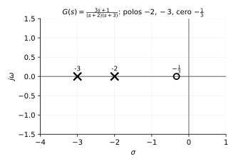
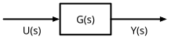
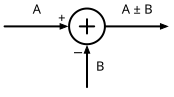
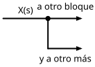
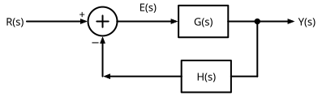
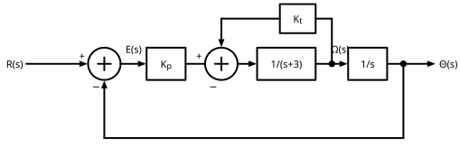
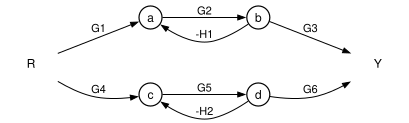

# Control Analógico
## Módulo 2 — Función de Transferencia y Diagramas de Bloques
### *Aprender a conectar cajas: de piezas sueltas a sistemas completos*

> **Referencias:** Kuo, *Automatic Control Systems* (Cap. 3) | Ogata, *Modern Control Engineering* (Cap. 2)
> **Herramientas:** Python (`control`, `sympy`, `matplotlib`) · GNU Octave
> **Prerrequisito:** Módulo 1

---

### Cómo leer este módulo

Misma disciplina que en el Módulo 1. Cada sección responde, en orden:

1. **¿Qué problema del mundo real estamos mirando?**
2. **¿Por qué necesitamos esta herramienta?**
3. **¿Cómo se construye?** — la mecánica.
4. **¿Qué me dice esto que no veía antes?**
5. **¿Dónde más aparece esto?**

Si en algún punto solo ves álgebra, volviste a saltarte los pasos 1, 4 y 5.

---

## 2.0 La gran idea: de la caja aislada a la red de cajas

El Módulo 1 te enseñó a construir **una** caja: entrada, salida, y la función de transferencia que las conecta. Eso ya es útil, pero incompleto para el propósito real de este curso, porque **ningún sistema de control funciona con una sola caja aislada.**

Piensa en un termostato. No es solo "una caja que calienta". Es: un sensor que mide la temperatura actual, una resta contra la temperatura deseada, un amplificador que convierte esa diferencia en una señal de calefacción, y la habitación misma, cuya temperatura vuelve a alimentar al sensor. **La salida se mira a sí misma y se corrige.** Esa es la idea que hoy formalizamos: la **realimentación** (*feedback*).

> **La tesis del módulo:** Un sistema de control real es una **red de cajas conectadas**, y casi siempre una de esas conexiones cierra un lazo — la salida vuelve, comparada, a influir sobre la entrada. Este módulo te da dos herramientas complementarias para tomar esa red y colapsarla en una sola función de transferencia equivalente: **el álgebra de diagramas de bloques** (reducir paso a paso, muy visual) y la **fórmula de Mason** (una receta algebraica directa, muy poderosa cuando el lazo se enreda).

Y aquí va la pregunta que de verdad importa, la que motiva *todo* el resto del curso a partir de este punto:

**¿Por qué nos molestamos en cerrar el lazo?** Porque una caja abierta (lazo abierto) hace exactamente lo que su ecuación dice, sin importar si el resultado es el que querías, y sin corregirse si el mundo cambia (una carga extra, una ráfaga de viento, un componente que envejece). Una caja con su salida realimentada, en cambio, **se compara constantemente contra lo que quiere lograr y se corrige mientras actúa.** No necesita un modelo perfecto del mundo — necesita saber, en todo momento, cuánto se está equivocando. Esa idea, "actúa y corrige según el error", es la razón de ser de toda la ingeniería de control, y es transferible a cualquier proceso que se autorregule: un cuerpo sudando para no sobrecalentarse, un mercado ajustando precios, un hábito que corriges cuando te desvías de una meta.

Este módulo es, entonces, puramente **estructural**: no te dice todavía si el lazo cerrado se comporta bien o mal (eso empieza en el Módulo 3), solo te enseña a **encontrar la función de transferencia equivalente de cualquier red de cajas**, sea cual sea su forma. Esa función equivalente es el objeto que todos los módulos siguientes van a diseccionar.

---

## 2.1 Definición y obtención de la función de transferencia

### El problema: ¿cómo resumo un sistema en un solo objeto matemático?

Ya viste en el Módulo 1 varias funciones de transferencia particulares (masa-resorte, RLC, tanque). Ahora formalicemos qué es *en general*, porque la usaremos como la unidad básica de construcción de todo diagrama de bloques.

### Por qué la necesitamos

Trabajar siempre con la ecuación diferencial completa es engorroso, sobre todo cuando hay que **conectar varios subsistemas**. La función de transferencia empaqueta toda la dinámica del sistema en una sola expresión algebraica que se puede multiplicar, sumar y realimentar con álgebra ordinaria — el mismo espíritu de "muévete a un dominio donde el problema es fácil" que ya viste con las impedancias en 1.3.

### Cómo se construye

Toda EDO lineal de coeficientes constantes que relaciona una entrada $u(t)$ con una salida $y(t)$ tiene la forma general (Módulo 0, sección 0.5):

$$a_n y^{(n)} + a_{n-1}y^{(n-1)} + \cdots + a_0 y = b_m u^{(m)} + \cdots + b_0 u$$

**Definición.** La función de transferencia $G(s)$ es el cociente entre la Transformada de Laplace de la salida y la de la entrada, **asumiendo condiciones iniciales nulas**:

$$\boxed{G(s) = \frac{Y(s)}{U(s)} = \frac{b_m s^m + \cdots + b_1 s + b_0}{a_n s^n + \cdots + a_1 s + a_0}}$$

**Ejemplo.** Sea el sistema $\ddot{y} + 5\dot{y} + 6y = 3\dot{u} + u$. Aplicando Laplace con condiciones iniciales nulas:

$$(s^2+5s+6)Y(s) = (3s+1)U(s) \quad\Rightarrow\quad G(s) = \frac{3s+1}{s^2+5s+6} = \frac{3s+1}{(s+2)(s+3)}$$

Este $G(s)$ será nuestro ejemplo de referencia durante toda la sección 2.2.

### Qué te dice esto que no veías antes (y una advertencia honesta)

$G(s)$ es una propiedad **del sistema**, no de la entrada particular que le apliques: la misma $G(s)$ sirve para predecir la respuesta a un escalón, una rampa, un seno, lo que sea. Eso es justo lo que hace tan valioso el modelo — lo construyes una vez y lo interrogas con cualquier entrada.

Pero hay un precio, y hay que decirlo con la misma honestidad que usamos en 1.6 con la linealización: **$G(s)$ olvida de dónde partía el sistema.** Al forzar condiciones iniciales nulas, estamos capturando solo la *respuesta forzada* (la que causa la entrada), no la *respuesta libre* (la que causan las condiciones iniciales — ver 0.5). Para el diseño de controladores esto es, casi siempre, exactamente lo que quieres: te interesa cómo reacciona el sistema a partir de donde esté, no reconstruir su pasado. Pero consérvalo en mente: **una función de transferencia es un retrato del sistema en reposo, no de un instante congelado en movimiento.**

Una segunda condición práctica: para que $G(s)$ describa un sistema físico realizable, necesitas $n \geq m$ (el grado del denominador no puede ser menor que el del numerador). Un sistema con $m > n$ estaría prediciendo la salida *antes* de que ocurra el cambio en la entrada — no existe en el mundo físico causal.

> **Lección transferible:** Resumir un proceso complejo en "una relación fija entrada→salida, evaluada desde el reposo" es una simplificación deliberada, no un descuido. Se usa constantemente fuera de control: un modelo de negocio que ignora el estado inicial de la empresa y se concentra en "¿cómo responde a partir de ahora?" está haciendo exactamente lo mismo. Saber *qué información estás dejando fuera a propósito* es tan importante como saber qué estás capturando.

---

## 2.2 Polos, ceros y ganancia estática: leyendo el retrato sin resolver nada

### Por qué esta sección es la más rentable del módulo

Ya lo insinuamos en 1.2: **las raíces del denominador te dicen el comportamiento del sistema sin necesidad de calcular ninguna respuesta.** Ahora formalizamos esa lectura, porque será la herramienta de diagnóstico más usada del resto del curso.

### Los dos personajes: polos y ceros

Factoricemos numerador y denominador:

$$G(s) = K\frac{(s-z_1)(s-z_2)\cdots(s-z_m)}{(s-p_1)(s-p_2)\cdots(s-p_n)}$$

- **Polos** $p_i$: raíces del denominador. Son los valores de $s$ donde $G(s) \to \infty$.
- **Ceros** $z_i$: raíces del numerador. Son los valores de $s$ donde $G(s) = 0$.

Conceptualmente, piénsalos así:

> **Los polos son el ADN del sistema: definen los "modos" naturales de comportamiento (qué tan rápido decae, si oscila, si es estable) *independientemente* de qué entrada le apliques.** Son la ecuación característica de la EDO homogénea (0.5), vista desde otro ángulo. **Los ceros son el acento: no crean modos nuevos, pero modifican cuánto se excita cada modo existente**, pudiendo enfatizar, atenuar, o incluso producir efectos contraintuitivos (una respuesta que primero se mueve en la dirección "equivocada" antes de corregir, fenómeno que verás con detalle en el Módulo 3).

### La ganancia estática: cuánto responde el sistema "en el fondo"

Hay un tercer número que conviene leer de inmediato: la **ganancia estática** (o ganancia de CD), $G(0)$. Por el Teorema del Valor Final (Módulo 0), si el sistema es estable, $G(0)$ es exactamente el valor final que alcanza la salida ante un escalón unitario:

$$\text{ganancia estática} = G(0) = \lim_{s\to 0} G(s)$$

### Leyendo el ejemplo de 2.1

$$G(s) = \frac{3s+1}{(s+2)(s+3)}$$

- **Polos:** $s=-2,\ s=-3$ — ambos reales negativos → **estable**, respuesta que decae sin oscilar (ver tabla de 0.5).
- **Cero:** $s=-1/3$.
- **Ganancia estática:** $G(0) = \dfrac{1}{6} \approx 0.167$. Ante un escalón unitario, la salida se asentará cerca de $0.167$.

Sin resolver una sola fracción parcial, ya sabemos: el sistema es estable, no oscila, y termina cerca de $1/6$. **Esa es la potencia de leer polos, ceros y ganancia: predicción sin cálculo.**

### El mapa en el plano $s$



$\times$ = polo, $\circ$ = cero. Ambos polos a la izquierda del eje imaginario: estable (recuerda el mapa del plano $s$ de 0.1).

> **Lección transferible:** Antes de resolver cualquier problema complejo, pregúntate si existe un "resumen estructural" — unos pocos números — que ya te diga la forma general de la respuesta sin tener que ejecutar el proceso completo. En finanzas, los polos de un modelo de flujo de caja te dirían si una empresa tiende a estabilizarse o a divergir sin necesidad de proyectar cien escenarios. Leer la estructura antes de calcular es la marca de alguien que entiende, no solo que ejecuta.

---

## 2.3 Diagramas de bloques: elementos y álgebra

### El problema: los sistemas reales no son una sola caja

Un sistema de control típico tiene, mínimo: una planta, un controlador, un sensor, y la comparación entre lo deseado y lo medido. Necesitamos una notación gráfica estándar para esa red, y reglas de álgebra para combinarla.

### Los tres elementos

| **Bloque** — multiplica por $G(s)$ | **Punto de suma** — combina señales con signo | **Punto de toma** — la señal se copia, no se consume |
|:---:|:---:|:---:|
|  |  |  |

- **Bloque:** representa una función de transferencia. La señal que sale es la que entra, multiplicada por $G(s)$.
- **Punto de suma (o resta):** combina dos o más señales con signo. Es donde nace la idea de *error* — la resta entre lo que quieres y lo que tienes.
- **Punto de toma (*takeoff point*):** la misma señal se envía a dos destinos sin alterarse ni dividirse (no es un divisor de corriente; es una copia).

### Las tres conexiones fundamentales

**1. Serie (cascada).** La salida de un bloque alimenta al siguiente. Las funciones de transferencia se **multiplican**:

$$U \to \boxed{G_1} \to \boxed{G_2} \to Y \qquad\Longrightarrow\qquad \frac{Y(s)}{U(s)} = G_1(s)\,G_2(s)$$

**2. Paralelo.** La misma entrada alimenta a dos bloques cuyas salidas se suman. Las funciones de transferencia se **suman**:

$$\frac{Y(s)}{U(s)} = G_1(s) \pm G_2(s)$$

**3. Realimentación (feedback).** La conexión que de verdad importa en este curso. Una parte de la salida, pasada por $H(s)$, se resta (realimentación negativa) o se suma (positiva) a la entrada:



Aquí $E(s)$ es la **señal de error**: la diferencia entre lo que pides ($R$) y lo que el sensor reporta que estás obteniendo ($HY$). Planteemos el álgebra:

$$E(s) = R(s) - H(s)Y(s), \qquad Y(s) = G(s)E(s)$$

Sustituyendo y despejando $Y(s)/R(s)$:

$$Y(s) = G(s)\big[R(s) - H(s)Y(s)\big] \;\Rightarrow\; Y(s)\big[1+G(s)H(s)\big] = G(s)R(s)$$

$$\boxed{\frac{Y(s)}{R(s)} = \frac{G(s)}{1+G(s)H(s)} \quad \text{(realimentación negativa)}}$$

Para realimentación **positiva** (la salida se suma en vez de restarse), el mismo procedimiento da $\dfrac{G}{1-GH}$.

> **Detente aquí — esta fórmula es, sin exagerar, el objeto central de todo el curso a partir de ahora.** El producto $G(s)H(s)$ se llama **función de transferencia de lazo abierto**, y su comportamiento (dónde están sus polos, qué tan "grande" es) determinará en el Módulo 5 si el lazo cerrado es *estable*, en el Módulo 6 cómo se mueven sus polos al cambiar una ganancia (*root locus*), y en el Módulo 4 qué tan bien sigue el sistema una orden sin error permanente. Todo lo que sigue en el curso es, en el fondo, aprender a diseñar $G(s)H(s)$ para que $\dfrac{G}{1+GH}$ se comporte como quieres.

### Por qué la realimentación negativa es la que usamos casi siempre

Fíjate en el denominador $1+GH$. Si $|GH|$ es grande, entonces $\dfrac{G}{1+GH} \approx \dfrac{G}{GH} = \dfrac{1}{H}$: **el comportamiento del lazo cerrado deja de depender de $G$ (la planta, que puede ser incierta, no lineal, o cambiar con el tiempo) y pasa a depender casi solo de $H$ (el sensor, que tú eliges y puedes hacer preciso).** Esta es la razón profunda de usar realimentación: no porque "se vea prolijo" en un diagrama, sino porque **te vuelve inmune a tu propia ignorancia sobre la planta.** No necesitas conocer $G$ con precisión perfecta si el lazo está bien cerrado. Esta idea reaparecerá, formalizada, cuando hablemos de sensibilidad y de rechazo a perturbaciones.

> **Lección transferible:** "Corregir según el error observado" le gana casi siempre a "ejecutar un plan perfecto de antemano" precisamente porque no requiere que tu modelo del mundo sea exacto — solo que puedas medir qué tan lejos estás de la meta. Es la diferencia entre planear un viaje con un mapa perfecto (frágil si el mapa está mal) y manejar mirando la carretera y corrigiendo el volante constantemente (robusto aunque no sepas la ruta de memoria).

---

## 2.4 Reducción de diagramas de bloques

### El problema: diagramas con varios lazos anidados

Las tres reglas de 2.3 bastan para un lazo simple. Pero un sistema de control real casi siempre tiene **lazos dentro de lazos** — por ejemplo, un lazo interno rápido (velocidad) dentro de un lazo externo más lento (posición). Reducir estas redes exige una estrategia: **trabajar de adentro hacia afuera**, colapsando primero el lazo más interno.

### Reglas de manipulación útiles

Además de las tres conexiones básicas, conviene tener a mano estas equivalencias para reordenar un diagrama antes de reducirlo:

| Operación | Antes | Después |
|---|---|---|
| Mover un punto de suma antes de un bloque | resta después de $G$ | hay que dividir la señal restada entre $G$ |
| Mover un punto de toma antes de un bloque | toma después de $G$ | hay que multiplicar la copia por $G$ |
| Mover un punto de toma después de un bloque | toma antes de $G$ | hay que dividir la copia entre $G$ |
| Intercambiar dos puntos de suma consecutivos | — | el orden no importa (la suma es conmutativa) |

La idea común a todas: **cuando mueves un punto de suma o de toma a través de un bloque, tienes que "pagar" el paso multiplicando o dividiendo por ese bloque**, para que la señal que llega al destino final sea idéntica a la original.

### Ejemplo trabajado: control de posición con realimentación de velocidad

Retomemos el sistema rotacional del Módulo 1 (1.2): un disco con inercia $J=1$ y fricción $B=3$, sin resorte, cuya velocidad angular $\Omega(s)$ responde a un torque $T(s)$ como $\Omega(s)/T(s) = 1/(s+3)$, y cuya posición se obtiene integrando la velocidad, $\Theta(s) = \Omega(s)/s$. Recuerda la observación que dejamos pendiente en 1.2: *este sistema no tiene "memoria de posición" (no hay resorte), así que sin control se queda donde quedó.*

Vamos a controlarlo con **dos lazos anidados**, un diseño clásico de servomecanismos:

- **Lazo interno (velocidad):** un tacómetro mide $\Omega(s)$ y la realimenta con ganancia $K_t$ directamente sobre la señal de torque, *antes* de integrar.
- **Lazo externo (posición):** un sensor de posición mide $\Theta(s)$ y la realimenta con ganancia unitaria contra la posición deseada $R(s)$, a través de un controlador proporcional $K_p$.



**Paso 1 — reduce el lazo interno (velocidad).** El bloque $G_2(s)=\dfrac{1}{s+3}$ está realimentado negativamente con $H_1(s)=K_t$:

$$G_{\text{interno}}(s) = \frac{G_2}{1+G_2 K_t} = \frac{\frac{1}{s+3}}{1+\frac{K_t}{s+3}} = \frac{1}{s+3+K_t}$$

**Paso 2 — arma la trayectoria directa restante.** En cascada con $K_p$ y el integrador $1/s$:

$$G_{\text{directa}}(s) = K_p \cdot \frac{1}{s+3+K_t} \cdot \frac{1}{s} = \frac{K_p}{s(s+3+K_t)}$$

**Paso 3 — cierra el lazo externo (posición, unitario).**

$$\frac{\Theta(s)}{R(s)} = \frac{G_{\text{directa}}}{1+G_{\text{directa}}} = \frac{K_p}{s(s+3+K_t)+K_p} = \boxed{\frac{K_p}{s^2+(3+K_t)s+K_p}}$$

### Qué te dice esto que no veías antes

Compara este resultado con la forma canónica de segundo orden que viste en 1.2, $\dfrac{1}{Ms^2+Bs+K}$. Aquí $M=1$, el término "$K$" del resorte lo aporta **el controlador** ($K_p$), y el término "$B$" del amortiguador lo aporta **la ganancia del tacómetro** ($3+K_t$).

Esto es precioso: recuerda que en 1.2 definimos $\zeta = B/(2\sqrt{KM})$. Aquí, $\zeta = \dfrac{3+K_t}{2\sqrt{K_p}}$. **Puedes subir $K_t$ para amortiguar más el sistema (menos sobrepaso, menos oscilación) sin tocar $K_p$ — es decir, sin sacrificar la "rigidez" que fija qué tan rápido y firme sigue una orden de posición.** Sin el tacómetro, tu única perilla era $K_p$, y subirla para responder más rápido automáticamente te hacía *menos* amortiguado (más oscilante). Con dos perillas independientes, diseñas velocidad de respuesta y amortiguamiento por separado. Esta es la razón real, de ingeniería, por la que la realimentación de velocidad es un truco tan usado en servomecanismos — y es exactamente el tipo de decisión de diseño al que volverás, formalizada, en el Módulo 8.

> **Lección transferible:** Cuando un solo parámetro de ajuste te obliga a sacrificar una cosa por otra (velocidad por estabilidad), la solución de ingeniería casi nunca es "elegir mejor ese único parámetro" — es **añadir un lazo de realimentación adicional que mida algo más** (aquí, la velocidad, no solo la posición) para desacoplar los objetivos. En la vida y en la gestión pasa igual: si un solo indicador te obliga a elegir entre dos metas en tensión, busca una segunda señal que puedas medir y realimentar para perseguir ambas a la vez.

---

## 2.5 Diagramas de flujo de señal: la misma información, otra notación

### Por qué existe una segunda notación

El diagrama de bloques es visual e intuitivo, pero se vuelve difícil de manipular a mano cuando hay muchos lazos entrelazados — cada movimiento de un punto de suma o de toma es una oportunidad de equivocarse. El **diagrama de flujo de señal** (*signal flow graph*, SFG) guarda exactamente la misma información con una notación más austera, diseñada para que una **fórmula única** (Mason, 2.6) calcule la ganancia total sin mover nada a mano.

### Los elementos

- **Nodo:** representa una señal (una variable), no una operación. Se dibuja como un punto etiquetado.
- **Rama (branch):** una flecha dirigida de un nodo a otro, etiquetada con una ganancia. La señal del nodo destino es la suma de todas las ramas que llegan a él, cada una multiplicada por su ganancia.
- **Nodo fuente:** solo tiene ramas saliendo (la entrada, $R$).
- **Nodo sumidero:** solo tiene ramas entrando (la salida, $Y$).
- **Trayectoria directa (forward path):** un camino de la fuente al sumidero que no repite ningún nodo.
- **Lazo (loop):** un camino cerrado que regresa a su nodo de partida sin repetir nodos intermedios. Su **ganancia de lazo** es el producto de las ganancias de sus ramas.
- **Lazos que no se tocan (non-touching):** dos lazos que no comparten ningún nodo.

La diferencia clave frente al diagrama de bloques: **no hay símbolo especial para "sumar"** — la suma está implícita en que varias ramas lleguen al mismo nodo. Esto es lo que permite una fórmula puramente algebraica.

### Ejemplo: dos trayectorias que no se tocan

Construyamos un SFG con dos caminos independientes desde $R$ hasta $Y$, cada uno con su propio lazo local:



($R$ y $Y$ son, literalmente, el mismo nodo fuente y el mismo nodo sumidero en un único grafo; se dibujan en dos filas solo para que las dos trayectorias no se crucen visualmente.)

Aquí $L_1$ vive enteramente en los nodos $\{a,b\}$ y $L_2$ en $\{c,d\}$: **no comparten ningún nodo, así que no se tocan.** Este es exactamente el caso que la fórmula de Mason trata de forma especial, y es el ejemplo que resolveremos en 2.6.

> **Lección transferible:** Reescribir un mismo problema con una notación distinta y más austera —quitando símbolos redundantes, dejando solo lo esencial— suele revelar una fórmula cerrada que la notación original ocultaba. Pasar de "diagrama con símbolos de suma" a "grafo de nodos y ganancias" es la misma estrategia que pasar de prosa a una tabla, o de código imperativo a una fórmula matemática: menos ornamento, más estructura visible.

---

## 2.6 La fórmula de Mason: el atajo algebraico definitivo

### El problema que resuelve

Reducir un diagrama con muchos lazos, paso a paso como en 2.4, funciona pero es laborioso y propenso a error si los lazos están entrelazados de forma poco jerárquica. La **fórmula de ganancia de Mason** calcula la función de transferencia total de un SFG **de un solo golpe**, sin mover ni un bloque, con tal de que puedas identificar trayectorias y lazos correctamente.

### La fórmula

$$\boxed{\;G(s) = \frac{Y(s)}{R(s)} = \frac{\sum_k P_k \Delta_k}{\Delta}\;}$$

donde:

- $P_k$ = ganancia de la $k$-ésima trayectoria directa (producto de las ganancias de sus ramas).
- $\Delta$ = el **determinante del grafo**:

$$
\begin{aligned}
\Delta = {} & 1 - \sum(\text{ganancias de cada lazo individual}) \\
            & + \sum(\text{productos de pares de lazos que no se tocan}) \\
            & - \sum(\text{productos de ternas de lazos que no se tocan entre sí}) + \cdots
\end{aligned}
$$

- $\Delta_k$ = el valor de $\Delta$ calculado usando **solo la parte del grafo que no toca la trayectoria $P_k$** (se eliminan todos los lazos que comparten algún nodo con esa trayectoria).

### Por qué aparece ese término de "lazos que no se tocan"

Vale la pena entenderlo, no solo memorizarlo: $\Delta$ viene de resolver un sistema de ecuaciones lineales (una por nodo) mediante determinantes (regla de Cramer). **Dos lazos que no comparten ningún nodo son, algebraicamente, independientes entre sí** — no hay ninguna variable que los acople — así que su contribución conjunta al determinante es, literalmente, el producto de sus contribuciones individuales, igual que la probabilidad de dos eventos independientes es el producto de sus probabilidades. Dos lazos que **sí** se tocan, en cambio, comparten una variable, y esa dependencia rompe la simple multiplicación — por eso **no** aparecen emparejados en $\Delta$.

### Ejemplo trabajado: el grafo de 2.5

Retomemos el SFG de dos trayectorias no tocantes. Asignemos valores concretos: $G_1=2,\ G_2=3,\ G_3=1,\ H_1=1$ (trayectoria/lazo superior) y $G_4=1,\ G_5=2,\ G_6=4,\ H_2=0.5$ (trayectoria/lazo inferior).

**Trayectorias directas:**
$$P_1 = G_1G_2G_3 = 2\cdot3\cdot1 = 6 \qquad\qquad P_2 = G_4G_5G_6 = 1\cdot2\cdot4 = 8$$

**Lazos:**
$$L_1 = -G_2H_1 = -3 \qquad\qquad L_2 = -G_5H_2 = -1$$

Como $L_1$ (nodos $a,b$) y $L_2$ (nodos $c,d$) no comparten nodos, **no se tocan**, y aparece el término producto:

$$\Delta = 1-(L_1+L_2)+L_1L_2 = 1-(-3-1)+(-3)(-1) = 1+4+3 = 8$$

**Cofactores** $\Delta_k$: $P_1$ pasa por $\{a,b\}$, así que "toca" a $L_1$ pero no a $L_2$ → se elimina $L_1$, queda $L_2$:
$$\Delta_1 = 1-L_2 = 1-(-1) = 2$$

Simétricamente, $P_2$ toca a $L_2$ pero no a $L_1$:
$$\Delta_2 = 1-L_1 = 1-(-3) = 4$$

**Resultado final:**

$$\frac{Y(s)}{R(s)} = \frac{P_1\Delta_1+P_2\Delta_2}{\Delta} = \frac{6\cdot2 + 8\cdot4}{8} = \frac{12+32}{8} = \boxed{5.5}$$

### Qué te dice esto que no veías antes

Nota lo que *no* tuvimos que hacer: no movimos un solo bloque, no aplicamos las reglas de la tabla de 2.4. Con solo **catalogar** trayectorias y lazos (una tarea de inspección visual) y sustituir en una fórmula fija, obtuvimos la respuesta. Esa es la ventaja de Mason frente a la reducción manual: **cambia "manipular con criterio" por "contar con precisión"**, lo cual es mucho más difícil de arruinar en un sistema grande y enredado — a costa de que hay que ser meticuloso identificando cada lazo y cada par que no se toca.

> **Lección transferible:** Frente a un problema con muchas partes interactuando, a veces la estrategia ganadora no es "resolver paso a paso con criterio" (rápido pero frágil, un error se propaga) sino "enumerar sistemáticamente todas las estructuras relevantes y combinarlas con una fórmula fija" (más lento de plantear, pero mecánico y verificable). Mason es el ejemplo perfecto de cambiar juicio por inventario exhaustivo — la misma filosofía detrás de un checklist en vez de "usar el buen criterio" en una cabina de avión.

---

## 2.7 Práctica computacional

Verifiquemos con software los tres resultados de este módulo: el ejemplo de 2.1–2.2, la reducción con tacómetro de 2.4, y el SFG de Mason de 2.6.

### Práctica 2.7 — Python

```python
import control as ct
import sympy as sp
import matplotlib.pyplot as plt

# ---------------------------------------------------------------
# 1) Función de transferencia, polos, ceros, ganancia estática (2.1-2.2)
# ---------------------------------------------------------------
G = ct.tf([3, 1], [1, 5, 6])
print("G(s) =", G)
print("Polos:", ct.poles(G))
print("Ceros:", ct.zeros(G))
print("Ganancia estática G(0):", ct.dcgain(G))

# ---------------------------------------------------------------
# 2) Reducción con tacómetro (2.4): comparar CON y SIN K_t
# ---------------------------------------------------------------
Kp, Kt = 10.0, 2.0
s = ct.tf('s')

G2 = 1 / (s + 3)          # dinámica de velocidad
integrador = 1 / s

# --- con tacómetro ---
G_interno = ct.feedback(G2, Kt)                  # lazo interno de velocidad
G_directa = Kp * G_interno * integrador
T_con_Kt  = ct.feedback(G_directa, 1)            # lazo externo unitario

# --- sin tacómetro (Kt=0) ---
G_directa_sin = Kp * G2 * integrador
T_sin_Kt = ct.feedback(G_directa_sin, 1)

print("\nCon tacómetro:", T_con_Kt)
print("Sin tacómetro :", T_sin_Kt)

t1, y1 = ct.step_response(T_con_Kt)
t2, y2 = ct.step_response(T_sin_Kt)
plt.figure(figsize=(8, 4))
plt.plot(t1, y1, lw=2, label=f'con tacómetro (K_t={Kt})')
plt.plot(t2, y2, lw=2, ls='--', label='sin tacómetro (K_t=0)')
plt.title('Realimentación de velocidad: misma K_p, más amortiguamiento')
plt.xlabel('Tiempo (s)'); plt.ylabel('Θ(t)')
plt.legend(); plt.grid(True); plt.tight_layout(); plt.show()

# ---------------------------------------------------------------
# 3) Verificación simbólica del ejemplo de Mason (2.6)
# ---------------------------------------------------------------
G1, G2s, G3, G4, G5, G6, H1, H2 = 2, 3, 1, 1, 2, 4, 1, 0.5
P1, P2 = G1*G2s*G3, G4*G5*G6
L1, L2 = -G2s*H1, -G5*H2
Delta   = 1 - (L1+L2) + L1*L2
Delta1  = 1 - L2
Delta2  = 1 - L1
Y_R = (P1*Delta1 + P2*Delta2) / Delta
print(f"\nMason: Y/R = {Y_R}  (esperado: 5.5)")
```

### Práctica 2.7 — Octave

```octave
pkg load control

% --- 1) G(s), polos, ceros, ganancia estática ---
G = tf([3 1], [1 5 6])
polos = pole(G)
ceros = zero(G)
ganancia_estatica = dcgain(G)

% --- 2) Reducción con tacómetro ---
Kp = 10.0; Kt = 2.0;
s = tf('s');
G2 = 1/(s+3);
integrador = 1/s;

G_interno = feedback(G2, Kt);
G_directa = Kp * G_interno * integrador;
T_con_Kt  = feedback(G_directa, 1)

G_directa_sin = Kp * G2 * integrador;
T_sin_Kt = feedback(G_directa_sin, 1)

figure; hold on
step(T_con_Kt); step(T_sin_Kt)
legend('con tacómetro', 'sin tacómetro')
title('Efecto de la realimentación de velocidad')
grid on

% --- 3) Verificación numérica de Mason ---
G1=2; G2s=3; G3=1; G4=1; G5=2; G6=4; H1=1; H2=0.5;
P1 = G1*G2s*G3; P2 = G4*G5*G6;
L1 = -G2s*H1; L2 = -G5*H2;
Delta  = 1 - (L1+L2) + L1*L2;
Delta1 = 1 - L2; Delta2 = 1 - L1;
Y_R = (P1*Delta1 + P2*Delta2) / Delta;
fprintf('Mason: Y/R = %.4f (esperado 5.5)\n', Y_R)
```

> **Ejercicio de visión:** Corre la comparación con y sin tacómetro. Verás que la curva "con tacómetro" llega casi al mismo lugar (misma ganancia estática, porque $K_p$ no cambió) pero con menos sobrepaso. Eso es exactamente lo que predijo el análisis de $\zeta$ en 2.4 — antes de correr una sola línea de código.

---

## Ejercicios de Autoevaluación

> Igual que en el Módulo 1: las preguntas 👁 verifican que entendiste *para qué* sirve la herramienta, no solo cómo ejecutarla.

### Serie A — Función de Transferencia

**A.1** Obtén $G(s)=Y(s)/U(s)$ de $\ddot{y}+7\dot{y}+10y = 2\dot{u}+4u$.

**A.2** ¿Es $G(s) = \dfrac{s^3+2s}{s^2+1}$ físicamente realizable? Justifica con el criterio de 2.1. **👁 ¿Qué significaría, en términos de causa y efecto, que no lo fuera?**

**A.3** Dado el sistema masa-resorte-amortiguador del Módulo 1 con $M=1,B=4,K=3$, escribe $G(s)$ y verifica que sea propia.

**A.4** 👁 *Visión pura:* Explica con tus palabras por qué $G(s)$ "olvida" las condiciones iniciales. Da un ejemplo de una situación real de ingeniería donde eso sea justo lo que quieres, y otra donde te haría falta información adicional (pista: piensa en qué le pasa a un sistema justo al encenderlo).

---

### Serie B — Polos, Ceros y Ganancia Estática

**B.1** Para $G(s) = \dfrac{8(s+2)}{(s+1)(s+4)(s+5)}$, encuentra polos, ceros y ganancia estática. **👁 Sin resolver la respuesta al escalón, predice: ¿es estable? ¿oscilará?**

**B.2** Para $G(s) = \dfrac{5}{s^2+2s+5}$, encuentra los polos (complejos) y clasifica el tipo de respuesta esperada usando la tabla de 0.5.

**B.3** Un sistema tiene ganancia estática $3$ y polos en $-2$ y $-6$, sin ceros. Reconstruye una posible $G(s)$. **👁 ¿Es la única función de transferencia posible con esos datos? ¿Qué otro dato necesitarías para que sí lo fuera?**

**B.4** 👁 *La pregunta clave de la sección:* Dos sistemas comparten exactamente los mismos polos pero tienen ceros distintos. ¿Sus respuestas al escalón serán idénticas? Relaciona tu respuesta con la metáfora "polos = ADN, ceros = acento".

---

### Serie C — Álgebra de Diagramas de Bloques

**C.1** Deriva la fórmula de la conexión en paralelo desde cero (plantea las ecuaciones de suma, no la copies de memoria).

**C.2** Deriva $Y(s)/R(s)$ para realimentación **positiva** (el punto de suma es $+H$, no $-H$). **👁 Físicamente, ¿qué le pasa al sistema si en algún momento $G(s)H(s) \to 1$? ¿Por qué la realimentación positiva es peligrosa y se usa mucho menos que la negativa?**

**C.3** Reduce a una sola función de transferencia: tres bloques en cascada $G_1=2$, $G_2=\dfrac{1}{s+1}$, $G_3=\dfrac{3}{s+2}$, con realimentación unitaria negativa alrededor de todo el conjunto.

**C.4** 👁 Sin repetir el álgebra completa: usando el resultado de 2.4 ($T(s)=\dfrac{K_p}{s^2+(3+K_t)s+K_p}$), explica en palabras por qué subir $K_t$ aumenta el amortiguamiento **sin** cambiar la ganancia estática del lazo cerrado ante un escalón (pista: evalúa $T(0)$ y fíjate qué parámetro desaparece).

---

### Serie D — Diagramas de Flujo de Señal y Mason

**D.1** Dibuja el SFG equivalente al diagrama de bloques de realimentación negativa simple de 2.3 (bloques $G(s)$, $H(s)$). Identifica su única trayectoria directa y su único lazo, y verifica con Mason que obtienes $\dfrac{G}{1+GH}$.

**D.2** Un SFG tiene dos lazos que **no se tocan**: $L_1=-2$, $L_2=-0.5$, y una sola trayectoria directa $P_1=10$ que toca a ambos lazos. Calcula $Y/R$ con Mason. **(Nota: si $P_1$ toca a ambos lazos, $\Delta_1 = 1$.)**

**D.3** *(Desafío)* Un SFG tiene tres lazos: $L_1=-1$, $L_2=-2$, $L_3=-1$, donde $L_1$ y $L_2$ se tocan entre sí, pero $L_3$ no toca a ninguno de los otros dos. Hay una única trayectoria $P_1=4$ que toca a los tres lazos. Calcula $\Delta$ y $Y/R$.

**D.4** 👁 Explica, sin fórmulas, por qué **no** se puede simplemente multiplicar todas las ganancias de lazo entre sí para construir $\Delta$ cuando algunos lazos se tocan. ¿Qué relación tiene esto con la idea de "eventos independientes" que mencionamos en 2.6?

---

### Serie E — Computacional y de Síntesis

**E.1** Reproduce en Python u Octave el ejemplo de 2.1–2.2 (`G = tf([3, 1], [1, 5, 6])`). Verifica a mano el cálculo de polos, ceros y ganancia estática contra la salida del programa.

**E.2** Reproduce la comparación con/sin tacómetro de 2.7 usando $K_p=20$ en vez de $10$. **👁 ¿Qué le pasa al amortiguamiento efectivo $\zeta$ al subir $K_p$ manteniendo $K_t$ fijo? ¿Confirma esto la intuición de 2.4 sobre por qué hace falta el tacómetro para no perder amortiguamiento al pedir más velocidad?**

**E.3** Verifica con `sympy` (símbolico) el resultado de Mason del ejercicio D.3, planteando $\Delta$, $\Delta_1$ y $P_1$ como expresiones simbólicas antes de sustituir números.

**E.4** 👁 *Proyecto de síntesis:* Toma el sistema masa-resorte-amortiguador del Módulo 1 ($G(s)=\dfrac{1}{Ms^2+Bs+K}$) y ciérralo con realimentación unitaria negativa y una ganancia proporcional $K_p$ en cascada. (a) Deriva simbólicamente el nuevo denominador de lazo cerrado. (b) Identifica cómo $K_p$ afecta a la frecuencia natural $\omega_n$ y al amortiguamiento $\zeta$ del lazo cerrado, comparados con los del sistema en lazo abierto. (c) 👁 Conjetura: si subes mucho $K_p$ para responder más rápido, ¿qué le pasará a $\zeta$? Guarda tu respuesta — la verificaremos con precisión en el Módulo 3.

---

### Respuestas Clave (parte de cálculo)

| Ej. | Respuesta |
|-----|-----------|
| A.1 | $G(s)=\dfrac{2s+4}{s^2+7s+10}=\dfrac{2s+4}{(s+2)(s+5)}$ |
| A.2 | No realizable: grado del numerador (3) > grado del denominador (2) |
| B.1 | Polos $-1,-4,-5$; cero $-2$; ganancia estática $=8\cdot2/(1\cdot4\cdot5)=0.8$ |
| B.2 | Polos $-1\pm j2$ → segundo orden subamortiguado, oscila y decae |
| C.3 | $T(s)=\dfrac{6}{(s+1)(s+2)+6}=\dfrac{6}{s^2+3s+8}$ |
| D.2 | $\Delta=1-(L_1+L_2)+L_1L_2=1-(-2.5)+1=4.5$; $\Delta_1=1$; $Y/R=10/4.5\approx2.22$ |
| D.3 | $\Delta=1-(L_1+L_2+L_3)+L_3(L_1+L_2)=1-(-4)+(-1)(-3)=1+4+3=8$; $\Delta_1=1$ (toca los tres); $Y/R=4/8=0.5$ |

> Las preguntas 👁 no tienen clave única: su valor está en el razonamiento que entrenan.

---

## Resumen del Módulo: lo que de verdad te llevas

**Las dos ideas grandes:**

1. **Un sistema de control real es una red de cajas, y casi siempre esa red cierra un lazo.** La realimentación negativa no es un adorno: te vuelve robusto frente a lo que no conoces con precisión de tu propia planta, porque corriges según el error medido, no según un plan perfecto de antemano.

2. **Hay dos caminos igual de válidos para colapsar la red en una sola función de transferencia: reducir paso a paso (más visual, mejor para lazos jerárquicos y simples) o aplicar la fórmula de Mason (más mecánica, mejor para topologías enredadas con muchos lazos entrelazados).** Ambos deben dar exactamente la misma respuesta — es una buena forma de verificar tu trabajo.

**Las dos habilidades que entrenaste:**

- **Leer** un sistema desde sus polos, ceros y ganancia estática, sin necesidad de resolver la respuesta completa.
- **Colapsar** una red de bloques o un grafo de flujo de señal en una única función de transferencia equivalente, por reducción o por Mason.

**El mapa de conexiones para tener a mano:**

| Conexión | Fórmula | Efecto conceptual |
|---|---|---|
| Serie (cascada) | $G_1 G_2$ | Las dinámicas se componen: la salida de una alimenta a la otra |
| Paralelo | $G_1 \pm G_2$ | Las respuestas se combinan de forma independiente |
| Realimentación negativa | $\dfrac{G}{1+GH}$ | El sistema se corrige según su propio error; gana robustez |
| Realimentación positiva | $\dfrac{G}{1-GH}$ | El sistema se refuerza a sí mismo; riesgo de fuga si $GH\to1$ |

> **La meta final del módulo, en una frase:** que ante cualquier red de subsistemas conectados —tenga o no lazos entrelazados— sepas encontrar, con confianza y por más de un camino, la única función de transferencia equivalente que describe al conjunto completo. Esa función equivalente es, a partir de aquí, el objeto que todo el resto del curso va a diseccionar: primero cómo responde en el tiempo (Módulo 3), luego qué tan bien sigue órdenes (Módulo 4), si es estable (Módulo 5), y finalmente cómo diseñarla a propósito (Módulos 6–8).

---

*Anterior: **Módulo 1 — Modelado de Sistemas Físicos***
*Siguiente: **Módulo 3 — Respuesta Temporal de Sistemas**, donde por fin veremos cómo se comporta en el tiempo la función de transferencia que ahora sabemos construir.*
