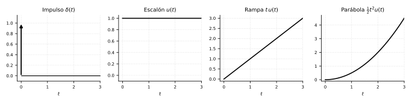
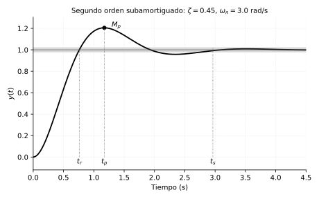
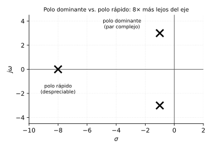

# Control Analógico
## Módulo 3 — Respuesta Temporal de Sistemas
### *Lo que el modelo predice, por fin, en el tiempo*

> **Referencias:** Kuo, *Automatic Control Systems* (Cap. 7) | Ogata, *Modern Control Engineering* (Cap. 5)
> **Herramientas:** Python (`control`, `numpy`, `matplotlib`) · GNU Octave
> **Prerrequisito:** Módulo 2

---

### Cómo leer este módulo

Misma disciplina que en los módulos 1 y 2:

1. **¿Qué problema del mundo real estamos mirando?**
2. **¿Por qué necesitamos esta herramienta?**
3. **¿Cómo se construye?** — la mecánica.
4. **¿Qué me dice esto que no veía antes?**
5. **¿Dónde más aparece esto?**

---

## 3.0 La gran idea: por fin, el tiempo

El Módulo 2 terminó con una promesa: una vez que sabes colapsar cualquier red de bloques en una sola $G(s)$, **¿qué haces con ella?** Hasta ahora la hemos leído de forma indirecta — polos que predicen estabilidad, ceros que modifican el énfasis — pero nunca hemos preguntado, sin rodeos: **si le aplico un escalón a este sistema, ¿qué curva dibuja $y(t)$ en el tiempo?**

Esa es la pregunta de este módulo, y es la más práctica de todo el curso hasta ahora. Un cliente, un jefe, o tú mismo ajustando un control, no preguntan "¿dónde están los polos?" — preguntan **"¿cuánto tarda en llegar?"**, **"¿se pasa de frenada?"**, **"¿cuándo puedo confiar en que ya llegó?"**. Ese vocabulario — tiempo de subida, sobrepaso, tiempo de establecimiento — es la traducción de los polos y ceros a algo que se puede poner en una hoja de especificaciones y exigirle a un ingeniero.

> **La tesis del módulo:** Todo el álgebra de los módulos 1 y 2 fue construir el mapa. Este módulo es la primera vez que **leemos el territorio**: convertimos $G(s)$ en una curva $y(t)$ concreta, y esa curva en un puñado de números que cualquiera — no solo un ingeniero de control — puede entender y exigir.

Y hay una cuenta pendiente que vamos a saldar aquí. En el Módulo 2 (ejercicio E.4) te pedimos conjeturar: *si subes $K_p$ en el lazo del tacómetro para responder más rápido, ¿qué le pasa a $\zeta$?* Dijiste (o debiste decir) que empeora. En este módulo, por fin, ponemos números reales a esa intuición.

---

## 3.1 Señales de prueba estándar

### El problema: no puedes probar contra "todas las entradas posibles"

Un sistema real recibirá, a lo largo de su vida, entradas de todo tipo: golpes súbitos, cambios de consigna, rampas de velocidad, ruido. No puedes caracterizar un sistema probándolo contra infinitas señales distintas. Necesitas un **puñado de señales estándar** que sean, a la vez, matemáticamente simples y representativas de lo que de verdad ocurre.

### Las cuatro señales, y qué situación real encarna cada una



| Señal | $f(t)$ | $F(s)$ | Qué situación real representa |
|---|---|---|---|
| Impulso $\delta(t)$ | golpe instantáneo | $1$ | Una perturbación súbita: un golpe de viento, un pico de carga. |
| Escalón $u(t)$ | salto y se queda | $\dfrac{1}{s}$ | Un cambio brusco de consigna: "de 20°C pasa a pedir 25°C ya". |
| Rampa $t\,u(t)$ | crece linealmente | $\dfrac{1}{s^2}$ | Seguir algo que se mueve a velocidad constante: un radar rastreando un avión. |
| Parábola $\tfrac12t^2u(t)$ | aceleración constante | $\dfrac{1}{s^3}$ | Seguir algo que acelera: un misil, un ascensor arrancando. |

### Por qué el escalón es el protagonista del módulo

De las cuatro, **el escalón es la que usaremos casi todo el módulo**, por tres razones concretas: (1) es físicamente realizable — puedes literalmente accionar un interruptor, no puedes aplicar un impulso perfecto; (2) excita tanto el transitorio (cómo llega) como el estado estacionario (dónde se queda), a diferencia del impulso que se apaga solo; (3) es la entrada más común en la práctica — casi todo cambio de consigna es, en esencia, un escalón.

> **Lección transferible:** Cuando necesites evaluar cualquier sistema complejo — un proceso, una organización, un algoritmo — no lo pruebes contra "todo lo que podría pasar". Diseña un puñado pequeño de escenarios estándar, elegidos porque son simples de aplicar *y* porque revelan tanto el comportamiento inmediato como el de largo plazo. Esa es la disciplina detrás de cualquier batería de pruebas bien diseñada, dentro o fuera de la ingeniería.

---

## 3.2 Respuesta de sistemas de primer orden

### Retomando el hilo del Módulo 1

En 1.5 conociste el arquetipo de primer orden — el tanque, el cuerpo que se enfría — y la constante de tiempo $\tau$. Ahora lo formalizamos con la herramienta que ya tenemos: la respuesta al escalón, calculada desde $G(s)$.

### La cuenta, hecha una sola vez

Tomemos el tanque de 1.5: $G(s) = \dfrac{K}{\tau s+1}$, con $K=2$, $\tau=6$ (los mismos $R=2,\,C=3$ de aquella práctica). Ante un escalón unitario, $U(s)=1/s$:

$$Y(s) = \frac{K}{\tau s+1}\cdot\frac{1}{s} = \frac{2}{s(6s+1)}$$

Fracciones parciales (0.3) y transformada inversa dan:

$$\boxed{y(t) = K\left(1-e^{-t/\tau}\right) = 2\left(1-e^{-t/6}\right)}$$

### Leyendo la curva: formalizando lo que ya intuías

En $t=\tau=6\text{s}$: $y=2(1-e^{-1})=1.264$, el **63.2%** del valor final. En $t=4\tau=24\text{s}$: $y=1.963$, el **98.2%**. Esto ya lo viste en 1.5 como una regla de servilleta; ahora tiene nombre formal: el **tiempo de establecimiento al 2%** de un primer orden es

$$\boxed{t_s \approx 4\tau}$$

**Ningún sistema de primer orden oscila ni se pasa de frenada** — matemáticamente, porque $y(t)$ es una exponencial pura, monótona, sin término seno. Guarda esa palabra, "monótona": es la frontera exacta que separa el primer orden del segundo, que es donde empieza lo interesante.

> **Lección transferible:** "Acercarse sin pasarse" es el comportamiento por defecto de cualquier sistema con un solo lugar donde acumular. Solo cuando hay **dos** almacenes compitiendo (masa↔resorte, inductor↔capacitor) aparece la posibilidad de pasarse de frenada. Antes de esperar oscilación en cualquier fenómeno, pregúntate: ¿hay de verdad dos cosas que se pasan energía entre sí, o solo una que se llena?

---

## 3.3 Respuesta de sistemas de segundo orden

### El corazón del módulo

Aquí vive el comportamiento que de verdad le importa a un ingeniero de control: **el segundo orden subamortiguado**, el que oscila y se calma. Retomemos la forma canónica del Módulo 1:

$$G(s) = \frac{1}{Ms^2+Bs+K}$$

y reescribámosla en la **forma estándar** que usa todo el resto del curso, dividiendo por $M$:

$$\boxed{G(s) = \frac{\omega_n^2}{s^2+2\zeta\omega_n s+\omega_n^2}}\qquad\text{(ganancia de CD unitaria)}$$

donde, igualando término a término con $\tfrac{1}{M}\cdot\dfrac{1}{s^2+(B/M)s+(K/M)}$:

$$\omega_n = \sqrt{\frac{K}{M}}\qquad\qquad \zeta = \frac{B}{2\sqrt{KM}}$$

$\omega_n$ (**frecuencia natural**) es qué tan rápido "querría" oscilar el sistema si nada lo frenara. $\zeta$ (**factor de amortiguamiento**, el mismo que mediste en la Práctica 1.2) es la proporción entre freno y empuje — ya lo conoces, hoy le ponemos fórmulas de respuesta encima.

### Los cuatro personajes de $\zeta$

| $\zeta$ | Nombre | Comportamiento |
|---|---|---|
| $\zeta=0$ | No amortiguado | Oscila para siempre, nunca se asienta. |
| $0<\zeta<1$ | **Subamortiguado** | Oscila, decae, se asienta. El caso que más nos importa. |
| $\zeta=1$ | Críticamente amortiguado | La frontera: llega lo más rápido posible *sin* oscilar. |
| $\zeta>1$ | Sobreamortiguado | No oscila, pero llega más lento que el crítico. |

### La fórmula de la curva subamortiguada

Con $\omega_d = \omega_n\sqrt{1-\zeta^2}$ (la **frecuencia amortiguada**, la que de verdad se observa oscilando) y $\beta=\arccos\zeta$, la respuesta al escalón unitario es:

$$y(t) = 1 - \frac{e^{-\zeta\omega_n t}}{\sqrt{1-\zeta^2}}\sin(\omega_d t+\beta)$$

No memorices esta fórmula sin mirarla: **es una senoidal de frecuencia $\omega_d$, metida dentro de una envolvente $e^{-\zeta\omega_n t}$ que la apaga.** $\zeta\omega_n$ decide qué tan rápido se apaga la envolvente; $\omega_d$ decide qué tan rápido oscila por dentro. Todo lo que viene en 3.4 es leer esos dos números.

### Verificando con el ejemplo del Módulo 1

Masa-resorte-amortiguador con $M=1,\,B=2,\,K=10$: $\omega_n=\sqrt{10}=3.162$ rad/s, $\zeta=\dfrac{2}{2\sqrt{10}}=0.316$. Subamortiguado ($0<\zeta<1$): oscilará, tal como viste en la gráfica de la Práctica 1.2 — ahora sabes exactamente qué curva es esa.

> **Lección transferible:** Cualquier respuesta que "se pasa y vuelve, cada vez con menos fuerza" —una negociación que sobrecorrige antes de estabilizarse, un termostato mal calibrado, una economía ajustándose tras una crisis— tiene, escondidos, un $\zeta$ y un $\omega_n$ propios. Reconocer que un fenómeno es "un segundo orden subamortiguado" te da acceso inmediato a todo este aparato matemático, aunque el fenómeno no tenga nada de mecánico.

---

## 3.4 Especificaciones temporales

### Por qué esta sección paga el módulo entero

Aquí traducimos $\zeta$ y $\omega_n$ — abstractos, cómodos para el ingeniero — al vocabulario que exige un cliente: **¿cuándo llega, cuánto se pasa, cuándo puedo confiar en que ya llegó?**



> La curva de la figura usa $\zeta=0.45$, $\omega_n=3$ rad/s — valores genéricos, elegidos solo para que las cuatro especificaciones se vean claras en una sola gráfica. No corresponden a ningún sistema particular del curso.

### Las cuatro especificaciones, una por una

**Tiempo pico $t_p$** — cuándo ocurre el primer (y mayor) sobrepaso. Es el instante en que la envolvente de la fórmula de 3.3 hace que la derivada se anule por primera vez:

$$\boxed{t_p = \frac{\pi}{\omega_d}}$$

**Sobrepaso máximo $M_p$** — qué tan lejos se pasa del valor final, en fracción (o porcentaje) del salto:

$$\boxed{M_p = e^{-\zeta\pi/\sqrt{1-\zeta^2}}}$$

Fíjate en algo importante: **$M_p$ depende solo de $\zeta$**, no de $\omega_n$. $\omega_n$ decide la *velocidad* de todo el fenómeno; $\zeta$ decide *cuánto* se pasa. Son perillas independientes — y esa independencia es exactamente lo que explotaba el tacómetro del Módulo 2.

**Tiempo de establecimiento $t_s$** — cuándo la curva entra, para no volver a salir, en una banda de $\pm 2\%$ alrededor del valor final. Sale de exigir que la envolvente $e^{-\zeta\omega_n t}$ baje de $0.02$:

$$\boxed{t_s \approx \frac{4}{\zeta\omega_n}}\qquad\text{(criterio del 2\%; el 5\% usa }3\text{ en vez de }4\text{)}$$

**Tiempo de subida $t_r$** — cuándo la curva cruza por primera vez el valor final (0% a 100%, para un subamortiguado):

$$t_r = \frac{\pi-\beta}{\omega_d}\qquad\text{con }\beta=\arccos\zeta$$

Existe una aproximación muy usada, $t_r\approx 1.8/\omega_n$ — pero **solo es razonable para $\zeta$ entre 0.3 y 0.8** aproximadamente. Fuera de ese rango, usa la fórmula exacta. (La misma honestidad de 1.6: una aproximación es útil *donde es válida*, no en todas partes.)

### Cerrando la cuenta pendiente del Módulo 2

Retomemos el control con tacómetro: $T(s)=\dfrac{K_p}{s^2+(3+K_t)s+K_p}$, de donde $\omega_n=\sqrt{K_p}$ y $\zeta=\dfrac{3+K_t}{2\sqrt{K_p}}$. Con $K_p=10$:

| | $\zeta$ | $M_p$ | $t_p$ | $t_s$ (2%) |
|---|---|---|---|---|
| **Sin tacómetro** ($K_t=0$) | $0.474$ | $18.4\%$ | $1.13\,\text{s}$ | $2.67\,\text{s}$ |
| **Con tacómetro** ($K_t=2$) | $0.791$ | $1.7\%$ | $1.62\,\text{s}$ | $1.60\,\text{s}$ |

**Ahí está la respuesta a la conjetura de E.4, con números.** Subir $K_t$ sí empeora (alarga) el tiempo pico — el sistema tarda más en llegar a su primer máximo. Pero mira $t_s$: **mejora**, y bastante. La razón es exactamente la intuición que se pedía en el Módulo 2: sin tacómetro, el sistema se pasa tanto (18.4%) que tarda una eternidad en dejar de rebotar dentro de la banda del 2%; con tacómetro, casi no se pasa, así que aunque su pico llega más tarde, **entra a la banda y se queda** mucho antes. "Más rápido" y "menos oscilante" no son la misma perilla — y a veces, sacrificar un poco de $t_p$ compra mucho de $t_s$.

> **Lección transferible:** Cuando optimices cualquier sistema con más de un objetivo en tensión (velocidad vs. estabilidad, costo vs. calidad), cuidado con optimizar la métrica más visible (aquí, "¿qué tan rápido llega al pico?") a costa de la que en realidad importa al usuario (aquí, "¿cuándo puedo confiar en que ya llegó y no se va a mover?"). Son preguntas distintas, y a veces la respuesta correcta es la que se ve "más lenta" en la métrica equivocada.

---

## 3.5 Sistemas de orden superior y polos dominantes

### El problema: casi nada es *exactamente* de segundo orden

Un sistema real rara vez tiene solo dos polos. Pero toda la maquinaria de 3.3-3.4 es de segundo orden. ¿Se pierde todo cuando hay tres, cuatro, diez polos?

### La idea del polo dominante

No, si tienes suerte con la geometría. Recuerda: cada polo $-\sigma_i$ aporta un término $e^{-\sigma_i t}$ a la respuesta. **Cuanto más lejos esté un polo del eje imaginario, más rápido se apaga su contribución.** Si un par de polos complejos está mucho más cerca del eje que todos los demás, su exponencial tarda mucho más en morir — y mientras los demás términos ya desaparecieron, **ese par sigue solo, dictando la forma de la curva.**



**Regla práctica:** si un polo (o par) está **5 veces o más** lejos del eje imaginario que el resto, se puede ignorar y tratar el sistema como si fuera de segundo orden puro, usando solo el par dominante para calcular $\zeta$, $\omega_n$ y todas las especificaciones de 3.4.

### Qué te dice esto que no veías antes

Esta es la razón práctica de por qué el segundo orden domina el vocabulario de todo el curso: **no es que los sistemas reales sean de segundo orden — es que casi siempre se comportan *como si lo fueran*, porque un par de polos gana la carrera.** Diseñar, entonces, casi siempre se reduce a **colocar deliberadamente un par de polos dominante** donde quieras, y asegurarte de que el resto queden lo bastante lejos como para no estorbar. Eso es, en esencia, lo que hará el root locus en el Módulo 6.

> **Lección transferible:** En cualquier sistema complejo con muchas causas simultáneas, casi siempre hay una que decide el resultado observable mientras las demás son ruido de fondo ya extinguido. Encontrar *cuál* causa domina — y verificar que de verdad esté lo bastante separada de las demás — vale más que modelar las diez causas con el mismo detalle.

---

## 3.6 Efecto de ceros adicionales

### La advertencia que dejamos pendiente en el Módulo 2

En 2.2 dijimos: los ceros no crean modos nuevos, pero "pueden enfatizar, atenuar, o incluso producir efectos contraintuitivos". Cumplamos esa promesa.

### Un cero cercano y a la izquierda: acelera y exagera

Añadir un cero en $-z$ a una $G(s)$ de segundo orden (manteniendo la ganancia de CD) **aumenta el sobrepaso** y adelanta el tiempo pico, tanto más cuanto más cerca esté el cero del origen (es decir, cuanto más cerca esté de los polos dominantes). Intuición: un cero actúa parcialmente como un término derivativo, y la derivada de una curva creciente **empuja hacia arriba** al principio de la respuesta.

### Un cero en el semiplano derecho: la respuesta inversa

Aquí está el caso verdaderamente contraintuitivo, y es real, no una curiosidad de examen: si el cero está en el **semiplano derecho** ($+z$, un sistema de "fase no mínima"), la respuesta **empieza moviéndose en la dirección contraria** a donde terminará, antes de dar la vuelta y llegar a su destino. Físicamente ocurre, por ejemplo, en un avión que baja momentáneamente el morro antes de subir, o en la caldera de una planta de vapor cuya presión cae brevemente antes de subir cuando se le pide más potencia.

> **Por qué importa en la práctica:** un controlador ingenuo que solo mira "¿la salida se está moviendo en la dirección correcta?" puede reaccionar exactamente al revés de lo debido durante ese instante inicial. Saber que tu planta tiene un cero de fase no mínima es, literalmente, saber que no puedes confiar en el signo del movimiento inicial.

> **Lección transferible:** Que algo se mueva, al principio, en la dirección "equivocada" no siempre es una señal de error — a veces es la firma de una dinámica más profunda (un cero de fase no mínima) que exige paciencia antes de juzgar la tendencia. Antes de reaccionar al primer movimiento de cualquier sistema — un indicador económico, una métrica de producto — pregúntate si podría tratarse de una respuesta inversa legítima, no de un fracaso.

---

## 3.7 Práctica computacional

### Práctica 3.7 — Python

```python
import numpy as np
import control as ct
import matplotlib.pyplot as plt

# ---------------------------------------------------------------
# 1) Primer orden: el tanque de 1.5 (K=2, tau=6)
# ---------------------------------------------------------------
G1 = ct.tf([2], [6, 1])
t1, y1 = ct.step_response(G1)
info1 = ct.step_info(G1)
print("Primer orden — step_info:", info1)

# ---------------------------------------------------------------
# 2) Segundo orden: masa-resorte-amortiguador de 1.2 (M=1,B=2,K=10)
# ---------------------------------------------------------------
G2 = ct.tf([10], [1, 2, 10])
info2 = ct.step_info(G2)
wn = np.sqrt(10); zeta = 2/(2*wn)
print(f"\nSegundo orden: zeta={zeta:.3f}, wn={wn:.3f}")
print("step_info (verifica contra las fórmulas de 3.4):", info2)

# ---------------------------------------------------------------
# 3) La cuenta pendiente del Módulo 2: con y sin tacómetro
# ---------------------------------------------------------------
s = ct.tf('s')
Kp, Kt = 10.0, 2.0
G_vel = 1/(s+3)
T_con = ct.feedback(Kp * ct.feedback(G_vel, Kt) * (1/s), 1)
T_sin = ct.feedback(Kp * G_vel * (1/s), 1)

for nombre, T in [("con tacómetro", T_con), ("sin tacómetro", T_sin)]:
    info = ct.step_info(T)
    print(f"\n{nombre}: Mp={info['Overshoot']:.1f}%  "
          f"tp={info['PeakTime']:.2f}s  ts={info['SettlingTime']:.2f}s")

t, y = ct.step_response(T_con)
t2, y2 = ct.step_response(T_sin)
plt.figure(figsize=(8, 4))
plt.plot(t, y, lw=2, label='con tacómetro')
plt.plot(t2, y2, lw=2, ls='--', label='sin tacómetro')
plt.title('Menos sobrepaso, más rápido en asentarse (aunque el pico llegue después)')
plt.xlabel('Tiempo (s)'); plt.ylabel(r'$\Theta(t)$')
plt.legend(); plt.grid(True); plt.tight_layout(); plt.show()

# ---------------------------------------------------------------
# 4) Efecto de un cero (3.6): con y sin cero cercano, izquierda y derecha
# ---------------------------------------------------------------
G_base = ct.tf([10], [1, 2, 10])          # sin cero
G_zero_izq = ct.tf([10/3*1, 10], [1, 2, 10])   # cero en s=-3 (izquierda)
G_zero_der = ct.tf([-10/3*1, 10], [1, 2, 10])  # cero en s=+3 (derecha, fase no mínima)

plt.figure(figsize=(8, 4))
for nombre, G in [("sin cero", G_base), ("cero en -3", G_zero_izq),
                   ("cero en +3 (fase no mínima)", G_zero_der)]:
    t, y = ct.step_response(G)
    plt.plot(t, y, lw=2, label=nombre)
plt.axhline(0, color='gray', lw=0.8)
plt.title('El cero de fase no mínima: arranca en la dirección "equivocada"')
plt.xlabel('Tiempo (s)'); plt.ylabel('y(t)')
plt.legend(); plt.grid(True); plt.tight_layout(); plt.show()
```

### Práctica 3.7 — Octave

```octave
pkg load control

% 1) Primer orden
G1 = tf([2], [6 1]);
info1 = stepinfo(G1)

% 2) Segundo orden
G2 = tf([10], [1 2 10]);
info2 = stepinfo(G2)
wn = sqrt(10); zeta = 2/(2*wn);
fprintf('zeta=%.3f wn=%.3f\n', zeta, wn)

% 3) Con y sin tacómetro
Kp = 10.0; Kt = 2.0;
s = tf('s');
G_vel = 1/(s+3);
T_con = feedback(Kp * feedback(G_vel, Kt) * (1/s), 1);
T_sin = feedback(Kp * G_vel * (1/s), 1);
stepinfo(T_con)
stepinfo(T_sin)

figure; hold on
step(T_con); step(T_sin)
legend('con tacómetro', 'sin tacómetro')
title('Menos sobrepaso, más rápido en asentarse')
grid on

% 4) Efecto de un cero
G_base = tf([10], [1 2 10]);
G_zero_izq = tf([10/3 10], [1 2 10]);
G_zero_der = tf([-10/3 10], [1 2 10]);
figure; hold on
step(G_base); step(G_zero_izq); step(G_zero_der)
legend('sin cero', 'cero en -3', 'cero en +3 (fase no mínima)')
title('El cero de fase no mínima')
grid on
```

> **Ejercicio de visión:** Corre la parte 4. Verás que la curva "cero en +3" empieza yendo *hacia abajo* antes de subir hacia el valor final. Eso no es un error del código — es exactamente el fenómeno de 3.6, viéndolo con tus propios ojos por primera vez.

---

## Ejercicios de Autoevaluación

### Serie A — Señales de Prueba y Primer Orden

**A.1** Escribe la Transformada de Laplace de una rampa de pendiente 3 (no unitaria), $f(t)=3t\,u(t)$.

**A.2** Un sistema de primer orden tiene $K=4$, $\tau=2$. Escribe $y(t)$ ante escalón unitario y calcula $t_s$ (2%). **👁 Sin calcular nada más: ¿en qué instante ya está al 63% del camino?**

**A.3** 👁 *Visión pura:* Explica, con tus palabras, por qué un sistema de primer orden *no puede* sobrepasar su valor final, usando la forma de $y(t)=K(1-e^{-t/\tau})$ (pista: mira el signo y el rango de cada término).

**A.4** Deriva $y(t)=K(1-e^{-t/\tau})$ desde $Y(s)=\dfrac{K}{s(\tau s+1)}$ usando fracciones parciales (0.3), paso a paso.

---

### Serie B — Segundo Orden

**B.1** Un sistema tiene $M=2$, $B=4$, $K=18$. Calcula $\zeta$ y $\omega_n$, y clasifica (sub/crítico/sobre-amortiguado).

**B.2** Dado $G(s)=\dfrac{25}{s^2+6s+25}$, identifica $\omega_n$, $\zeta$, $\omega_d$. **👁 ¿Oscilará? ¿Cómo lo sabes sin graficar?**

**B.3** 👁 Dos sistemas tienen el mismo $\zeta=0.5$ pero $\omega_n$ distinto ($\omega_n=2$ y $\omega_n=10$). ¿Cuál tendrá mayor sobrepaso $M_p$? Justifica con la fórmula de 3.4, no adivines.

**B.4** *(Desafío)* A partir de $y(t)$ de 3.3, deriva la condición $\dot y(t_p)=0$ y demuestra que $t_p=\pi/\omega_d$.

---

### Serie C — Especificaciones Temporales

**C.1** Para $\zeta=0.6$, $\omega_n=5$ rad/s, calcula $t_p$, $M_p$, $t_s$ (2%) y $t_r$ (fórmula exacta).

**C.2** Un sistema debe tener $M_p\leq 10\%$. **👁 ¿Qué valor mínimo de $\zeta$ se necesita?** (Despeja $\zeta$ de la fórmula de $M_p$, o razona con la tabla de 3.3 si prefieres estimar.)

**C.3** Dos diseños llegan al mismo $M_p$ pero uno tiene $\omega_n$ el doble que el otro. **👁 ¿Cuál tiene menor $t_s$? ¿Menor $t_p$? ¿Por qué ambos, y no solo uno?**

**C.4** Verifica con tus propios números la tabla de 3.4 (con/sin tacómetro): recalcula $\zeta$, $M_p$ y $t_s$ para $K_p=10$, $K_t=4$ (un tacómetro más agresivo). **👁 ¿La tendencia sigue siendo la misma que entre $K_t=0$ y $K_t=2$?**

---

### Serie D — Polos Dominantes y Ceros

**D.1** Un sistema tiene polos en $-1\pm j2$ y $-6$. **👁 ¿Es razonable aproximarlo como segundo orden puro? Aplica la regla del ×5 de 3.5.**

**D.2** Mismo caso que D.1 pero el tercer polo está en $-3$ en vez de $-6$. **👁 ¿Cambia tu respuesta? ¿Qué error esperarías al ignorar ese polo?**

**D.3** 👁 Explica, sin fórmulas, por qué un cero en el semiplano derecho puede hacer que la salida se mueva inicialmente en dirección opuesta a su destino final. Relaciona tu respuesta con la idea de "superposición de modos" (polos) más "énfasis" (ceros) del Módulo 2.

**D.4** *(Desafío)* Un sistema de segundo orden con $\zeta=0.5$, $\omega_n=4$ tiene además un cero en $s=-2$. Sin calcular la respuesta exacta, predice cualitativamente si el sobrepaso será mayor o menor que el de la versión sin cero, y por qué.

---

### Serie E — Computacional y de Síntesis

**E.1** Reproduce en Python u Octave los cuatro bloques de 3.7. Verifica que `step_info`/`stepinfo` coincida con tus cálculos a mano de C.1.

**E.2** 👁 Repite el experimento con/sin tacómetro (parte 3 de 3.7) para $K_p=20$. Compara con la tabla de 3.4: **¿$M_p$ mejora o empeora al subir $K_p$ manteniendo $K_t$ fijo? ¿Por qué, en términos de $\zeta=\frac{3+K_t}{2\sqrt{K_p}}$?**

**E.3** Modifica la parte 4 de 3.7 para colocar el cero cada vez más cerca del origen ($s=-1$, luego $s=-0.5$). **👁 ¿Qué le pasa al sobrepaso a medida que el cero se acerca a los polos dominantes? Relaciónalo con la advertencia de 3.6.**

**E.4** 👁 *Proyecto de síntesis:* Retoma cualquier sistema de segundo orden de los módulos 1-2 (mecánico, eléctrico, o el del tacómetro) y para tres valores distintos de un parámetro de tu elección (una ganancia, una masa, lo que sea), calcula y tabula $\zeta$, $\omega_n$, $M_p$, $t_s$. (a) ¿Existe un valor que minimice $t_s$ sin disparar $M_p$ por encima de, digamos, 15%? (b) Describe en un párrafo qué comprometerías y por qué si tuvieras que elegir uno de los tres para un cliente real.

---

### Respuestas Clave (parte de cálculo)

| Ej. | Respuesta |
|-----|-----------|
| A.1 | $F(s)=3/s^2$ |
| A.2 | $y(t)=4(1-e^{-t/2})$; $t_s\approx 8$ s; al 63% en $t=\tau=2$ s |
| B.1 | $\omega_n=3$, $\zeta=1/3\approx0.333$ → subamortiguado |
| B.2 | $\omega_n=5$, $\zeta=0.6$, $\omega_d=4$ → sí oscila ($0<\zeta<1$) |
| B.3 | Igual $M_p$ en ambos — $M_p$ solo depende de $\zeta$, no de $\omega_n$ |
| C.1 | $t_p=\pi/4=0.785$ s; $M_p=e^{-0.6\pi/0.8}\approx9.5\%$; $t_s=4/3=1.333$ s; $t_r=(\pi-0.927)/4\approx0.554$ s |
| C.2 | $\zeta\gtrsim0.591$ |
| D.1 | Sí: $6=6\times1$, cumple la regla del ×5 con margen |
| E.2 (verificación) | $K_p=20,K_t=2$: $\zeta=0.559\to M_p\approx12.0\%$, **peor** que con $K_p=10,K_t=2$ ($\zeta=0.791\to M_p\approx1.7\%$) — subir $K_p$ solo baja $\zeta=\frac{3+K_t}{2\sqrt{K_p}}$ si $K_t$ no sube con él |

> Las preguntas 👁 no tienen clave única: su valor está en el razonamiento que entrenan.

---

## Resumen del Módulo: lo que de verdad te llevas

**Las dos ideas grandes:**

1. **$G(s)$ deja de ser álgebra y se convierte en una curva concreta que se puede medir con una regla y un cronómetro.** Todo lo que hiciste en los módulos 1 y 2 estaba en función de esta traducción: de polos y ceros a $t_p$, $M_p$, $t_s$, $t_r$ — el vocabulario que de verdad se usa fuera de un curso de control.

2. **$\zeta$ y $\omega_n$ son perillas independientes: una decide qué tan rápido, la otra decide cuánto se pasa.** Diseñar un sistema de control es, la mayoría de las veces, encontrar la combinación de ambas que el problema real exige — y el ejemplo del tacómetro mostró que a veces "más rápido en el pico" y "más rápido en asentarse" tiran en direcciones distintas.

**Las dos habilidades que entrenaste:**

- **Traducir** cualquier $G(s)$ de segundo orden (o de orden superior con un par dominante) a sus cuatro especificaciones temporales, sin necesidad de graficar nada primero.
- **Anticipar** cualitativamente cómo un cero adicional —sobre todo uno de fase no mínima— distorsiona una respuesta que, por sus polos, ya creías conocer.

**El mapa de comportamientos para tener a mano:**

| Si $\zeta$... | El sistema... | Y $M_p$... |
|---|---|---|
| $=0$ | Oscila para siempre | $100\%$ (nunca se calma) |
| $0<\zeta<1$ | Subamortiguado: oscila y decae | $M_p=e^{-\zeta\pi/\sqrt{1-\zeta^2}}$ |
| $\geq 1$ | Crítico/sobreamortiguado | $0\%$ (no oscila) |

> **La meta final del módulo, en una frase:** que ante cualquier $G(s)$ —tuya o de un compañero, de un problema de examen o de un sistema real— puedas predecir, sin resolver una sola simulación, **cuánto tarda, cuánto se pasa y cuándo puedes confiar en que ya llegó.**

---

*Anterior: **Módulo 2 — Función de Transferencia y Diagramas de Bloques***
*Siguiente: **Módulo 4 — Error en Estado Estacionario**, donde cerraremos la otra mitad de la pregunta: no cuánto tarda en llegar, sino si de verdad llega exactamente donde se le pidió.*
